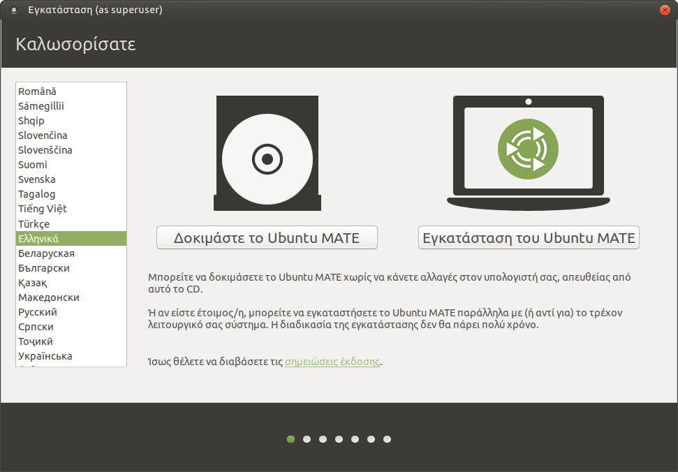

Για να κάνετε λήψη της τελευταίας έκδοσης του Ubuntu MATE, μεταβείτε
στον επίσημο [δικτυακό του χώρο](https://ubuntu-mate.org/download/).
Προσοχή, μας ενδιαφέρει η τελευταία LTS (Long Term Support) έκδοσή του
που υποστηρίζεται για 5 χρόνια ([απευθείας
σύνδεσμος](http://cdimage.ubuntu.com/ubuntu-mate/releases/20.04/release/ubuntu-mate-20.04.3-desktop-amd64.iso)),
και όχι η πιο πρόσφατη μη-LTS έκδοση που υποστηρίζεται μόνο για 9 μήνες.

Μόλις λάβετε το αρχείο .iso, κάψτε το σε ένα CD με όποιο πρόγραμμα
εγγραφής CDROM διαθέτετε. Εάν θέλετε μπορείτε εναλλακτικά να το
γράψετε σε ένα USB stick όπως αναφέρουμε στο
[Linux/liveusb](Linux/liveusb "wikilink") είτε ακολουθώντας [αυτές τις
οδηγίες](https://forum.ubuntu-gr.org/viewtopic.php?f=9&t=3899#p37282).
Τοποθετήστε το CD ή USB stick στον εξυπηρετητή και ρυθμίστε το BIOS (ή
πατήστε  για να βγει το boot menu) ώστε να ξεκινάει από αυτό. Στους
διαλόγους που θα εμφανιστούν, κάντε τις παρακάτω επιλογές.

## Δοκιμή περιβάλλοντος

{ align=right }

[350px](Αρχείο:install-01-welcome.png "wikilink") Μετά την εκκίνηση του
υπολογιστή από το live CD θα σας εμφανιστεί μία οθόνη που θα σας ρωτά
στην Αγγλική γλώσσα αν θα εγκαταστήσετε το Ubuntu ή θα το δοκιμάσετε.
Επιλέξτε τα  ως γλώσσα και κατόπιν πατήστε .

Στη συνέχεια θα βγει ο διάλογος "Καλώς ήλθατε", πατήστε  για να
εμφανιστεί η επιφάνεια εργασίας.

## Κυρίως περιβάλλον

[350px](Αρχείο:install-02-desktop.png "wikilink") Μετά την εκκίνηση του
υπολογιστή από το live CD θα σας εμφανιστεί το δοκιμαστικό περιβάλλον
του λειτουργικού περιβάλλοντος όπως αυτό φαίνεται στην εικόνα δεξιά
σας. Στο δοκιμαστικό περιβάλλον μπορείτε να εκτελέσετε όποια
προγράμματα θέλετε, να περιηγηθείτε στο διαδίκτυο και να
εξετάσετε ότι όλα λειτουργούν κανονικά (πχ: ήχος, αναγνώριση
δίσκων, δίκτυο κλπ). Εάν χρειάζεστε να αλλάξετε το μέγεθος των
κατατμήσεων του δίσκου σας πριν την εγκατάσταση, δείτε την ενότητα
για την εφαρμογή .

  - Όταν είστε έτοιμοι, κάντε διπλό κλικ στο εικονίδιο

## Καλωσορίσατε

[350px](Αρχείο:install-03-language.png "wikilink")

  - Βεβαιωθείτε ότι έχετε επιλέξει
  - Κλικ στο

## Διάταξη πληκτρολογίου

[350px](Αρχείο:install-04-keyboard-layout.png "wikilink")

  -
  -
  - Κλικ στο

## Ενημερώσεις και άλλο λογισμικό

[350px](Αρχείο:install-05-updates-and-other-software.png "wikilink")

  - Επιλέξτε
  - Επιλέξτε
  - Μην επιλέξετε την "Εγκατάσταση λογισμικού τρίτων για κάρτες γραφικών
    και Wi-Fi, καθώς και πρόσθετη υποστήριξη αναπαραγωγής πολυμέσων".
    Στο LTSP προτιμούνται οι ανοιχτοί οδηγοί συσκευών.
  - Κλικ στο

## Είδος εγκατάστασης

[350px](Αρχείο:install-06-installation-type.png "wikilink") Από αυτό το
διάλογο ορίζονται οι κατατμήσεις όπου θα εγκατασταθεί το Ubuntu.
Προσέξτε να μη διαγράψετε υπάρχουσες κατατμήσεις, εάν τυχόν έχετε
ήδη κάποιο λειτουργικό στον υπολογιστή σας. Μπορείτε να μειώσετε το
μέγεθος μίας υπάρχουσας κατάτμησης (πχ την NTFS των MS-Windows)
ώστε να προκύψει ελεύθερος χώρος για τη δημιουργία της κατάτμησης
του Ubuntu.

Επιλέξτε το είδος της εγκατάστασης ανάλογα με τις ανάγκες σας.

  - [Δεν υπάρχει εγκατεστημένο
    λειτουργικό.](Linux/LTSP/Εγκατάσταση_Ubuntu/Δίσκος_Κενός "wikilink")
  - [Υπάρχει MS-Windows λειτουργικό ήδη
    εγκατεστημένο.](Linux/LTSP/Εγκατάσταση_Ubuntu/Δίσκος_Ms-Windows "wikilink")
  - [Υπάρχει Linux λειτουργικό ήδη
    εγκατεστημένο.](Linux/LTSP/Εγκατάσταση_Ubuntu/Δίσκος_Linux "wikilink")

## Πού βρίσκεστε;

[350px](Αρχείο:install-08-where-are-you.png "wikilink")

  - Επιλέξτε
  - Κλικ στο

## Πώς λέγεστε;

[350px](Αρχείο:install-09-who-are-you.png "wikilink")

  - Το ονοματεπώνυμό σας:
  - Το όνομα του υπολογιστή σας: . Το όνομα κάθε σχολικού server είναι
    μοναδικό στο Π.Σ.Δ. και προκύπτει αν από το web site του σχολείου
    (π.χ. <http://12lyk-ioann.ioa.sch.gr>) κρατήσουμε το αρχικό κομμάτι
    (π.χ. 12lyk-ioann) και προσθέσουμε "srv-" μπροστά του.
  - Διαλέξτε ένα όνομα χρήστη: . Προτείνεται να μην αλλάξετε όνομα
    χρήστη, επειδή αυτός είναι ο ιδιοκτήτης των κοινόχρηστων
    φακέλων.
  - Διαλέξτε ένα συνθηματικό (κωδικός πρόσβασης):
  - Επιβεβαιώστε το συνθηματικό:
  - Εάν θέλετε ο administrator να συνδέεται κατευθείαν με το που ανοίγει
    ο εξυπηρετητής, επιλέξτε . Αυτό μπορείτε να το ρυθμίσετε και
    αργότερα.
  - Κλικ στο κουμπί

## Αντιγραφή αρχείων

[350px](Αρχείο:install-10-progress.png "wikilink") Εάν θέλετε, όσο
περιμένετε να προχωρήσει η εγκατάσταση (περίπου 15', ανάλογα με
την ταχύτητα της σύνδεσής σας στο Internet), ακολουθήστε την ενότητα
για την [εκκίνηση των σταθμών εργασίας από το
δίκτυο](Linux/LTSP/Εκκίνηση_από_το_δίκτυο "wikilink"), και
στη συνέχεια επιστρέψτε εδώ.

## Η εγκατάσταση ολοκληρώθηκε

[350px](Αρχείο:install-11-installation-complete.png "wikilink")

  - Κλικ στο
