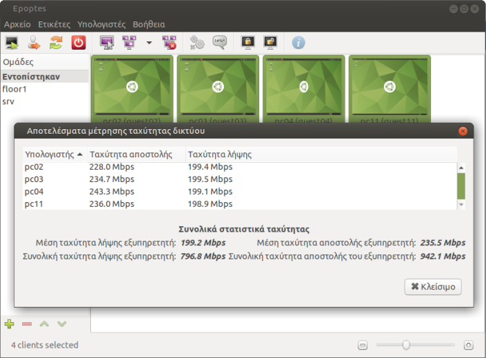

# Μέτρηση ταχύτητας δικτύου

!!! tip "Συμβουλή"
    Προτείνεται ο εξυπηρετητής και οι σταθμοί εργασίας να είναι συνδεδεμένοι
    στο ίδιο switch. Το switch να έχει τουλάχιστον μία θύρα gigabit και ο
    server να συνδέεται σε αυτήν. Στην ιδανική περίπτωση, ο server να έχει δύο
    gigabit κάρτες δικτύου σε [λειτουργία bonding](../guides/bonding/index.md)
    και να συνδέονται σε δύο  θύρες gigabit του switch.

Η καλή λειτουργία του τοπικού δίκτυου LAN είναι προϋπόθεση για τον Επόπτη και
το LTSP, αλλά και για την απρόσκοπτη πρόσβαση στο Διαδίκτυο. Για τον έλεγχό
της, [εκκινήστε τον Επόπτη](../glossary/index.md#epoptes) και επιλέξτε **ανά
τέσσερις** τους υπολογιστές του εργαστηρίου. Πηγαίνετε στο μενού
***Υπολογιστές*** ▸ ***Μέτρηση ταχύτητας δικτύου*** και πατήστε το κουμπί
***Έναρξη***. Θα δείτε μια εικόνα σαν την ακόλουθη:

Τα συμπεράσματα που μπορούμε να εξάγουμε από την εικόνα είναι ως εξής:

- Στην ιδανική περίπτωση θα θέλαμε ο εξυπηρετητής να έχει 2 κάρτες δικτύου σε
  [λειτουργία bonding](../guides/bonding/index.md), οπότε να δούμε
  αποστολή/λήψη του server πάνω από 1.5 Gbps, και αποστολή/λήψη των clients
  γύρω στα 400 Mbps.
- Στην πιο συνηθισμένη περίπτωση που ο server και οι clients έχουν μία κάρτα
  gigabit, θα δούμε αποστολή/λήψη του εξυπηρετητή πάνω από 900 Mbps, και των
  clients γύρω στα 240 Mbps.
- Αν ο ίδιος ο server δείχνει λιγότερα από 100 Mbps, τότε δεν είναι
  συνδεδεμένος απευθείας σε gigabit θύρα του switch όπως θα έπρεπε και το
  εργαστήριο λειτουργεί 10 φορές πιο αργά.
- Αν κάποιοι clients δείχνουν λιγότερο από 100 Mbps, αυτό σημαίνει ότι:
    - η κάρτα δικτύου τους είναι 100 Mbps,
    - ή κάποιο chained switch είναι 100 Mbps,
    - ή κάποιο καλώδιο δικτύου έχει 4 αγωγούς αντί για 8 που χρειάζονται για
      gigabit,
    - ή κάποιος αγωγός ενός καλωδίου δικτύου ή μιας πρίζας τοίχου είναι
      χαλασμένο και η κάρτα δεν μπορεί να συντονίσει σε gigabit.

!!! note "Σημείωση"
    Αν επιλέγαμε και τους π.χ. 12 clients, θα ήταν όλοι κάτω από 100 Mbps λόγω
    διαμοιρασμού του bandwidth, και έτσι δεν θα μπορούσαμε να εντοπίσουμε ποιοι
    είναι κάτω από 100 Mbps λόγω προβλήματος.
