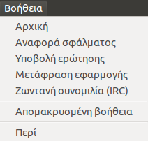
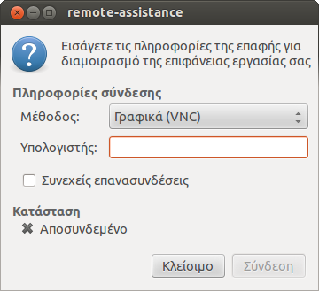

{.right33}
Αυτό το στοιχείο μενού σας παρέχει πρόσβαση σε αρχεία Βοήθειας της εφαρμογής
σε μορφή ιστοσελίδων HTML.

!!! info "Πληροφορία"
    Ενδεχομένως να χρειάζεστε πρόσβαση στο Internet για την προβολή
    μερικών επιλογών του μενού Βοήθεια.

## Σελίδα Επόπτη

Πιο συγκεκριμένα με την επιλογή ***Βοήθεια*** ▸ ***Αρχική*** μπορείτε να
μεταβείτε στην κεντρική ιστοσελίδα της εφαρμογής
[Επόπτης (Epoptes)](http://www.epoptes.org)
στην οποία μπορείτε να βρείτε περισσότερες πληροφορίες για το ++"Επόπτης (Epoptes)"++.

## Αναφορά σφάλματος

Με την δεύτερη επιλογή ***Αναφορά σφάλματος*** μεταφέρεστε στην ιστοσελίδα
[Issues](https://github.com/epoptes/epoptes/issues) στην οποία μπορείτε να
αναφέρεται κάποιο σφάλμα της εφαρμογής που τυχών αντιμετωπίσατε.

## Υποβολή ερώτησης

Σε περίπτωση που αντιμετωπίζετε κάποιο πρόβλημα με την λειτουργία της
εφαρμογής μπορείτε να μεταβείτε μέσω της επιλογής
***Υποβολή ερώτησης*** στην ιστοσελίδα
[Discussions](https://github.com/epoptes/epoptes/discussions)
και να υποβάλετε μια ερώτηση με το πρόβλημα σας ή να αναζητήσετε για παρόμοια προβλήματα.

## Ζωντανή Συνομιλία IRC

Δίνεται η δυνατότητα ζωντανής συνομιλίας μέσω
[IRC web chat](https://ts.sch.gr/wiki/IRC) με τους υπευθύνους ανάπτυξης της εφαρμογής μέσω
της επιλογής ***Ζωντανή συνομιλία IRC***. Συνήθως χρησιμοποιείται συνδυαστικά με την
[Απομακρυσμένη Βοήθεια](#απομακρυσμένη-βοήθεια).

## Απομακρυσμένη Βοήθεια

{.right33}
Επιπρόσθετα, στην υποβοήθηση των χρηστών σε περίπτωση προβλήματος υπάρχει η δυνατότητα
απομακρυσμένης βοήθειας μέσω της επιλογής ***Απομακρυσμένη βοήθεια***.
Με το μενού αυτό μπορείτε να διαμοιράσετε την οθόνη σας με κάποιον τεχνικό (π.χ. στο
ΚΕΠΛΗΝΕΤ) ώστε να σας καθοδηγήσει στην επίλυση ενός προβλήματος.
Μπορείτε επίσης να δηλώσετε την IP διεύθυνση του Η/Υ στο σπίτι σας ώστε
να έχετε πρόσβαση στον εξυπηρετητή του ΣΕΠΕΗΥ από το σπίτι σας. Η ιδέα
αυτής της επιλογής βασίζεται στην
[αντίστροφη σύνδεση με VNC](../Προχωρημένα/Απομακρυσμένη_πρόσβαση.md#πρόσβαση-με-vnc).
Με την ενεργοποίηση αυτής της λειτουργίας εμφανίζεται ο διάλογος που
φαίνεται στην εικόνα, δεξιά σας. Το μόνο που απαιτείται είναι
εισαγωγή της διεύθυνση IP του υπολογιστή εκείνου που θα συνδεθεί
και θα μοιραστεί την επιφάνεια εργασίας σας.

## Μετάφραση Επόπτη

Μέσω της επιλογής ***Μετάφραση εφαρμογής*** μπορείτε να μεταβείτε στην ιστοσελίδα
[Translations](https://epoptes.org/translations/) στην οποία μπορείτε
να δείτε τις γλώσσες στις οποίες έχει μεταφραστεί η εφαρμογή καθώς και
άμα το επιθυμείτε να συμμετάσχετε σε μια από αυτές.

!!! tip "Συμβουλή"
    Για την μετάφραση της εφαρμογής στην γλώσσα που εσείς επιθυμείτε το μόνο που απαιτείται είναι ένας περιηγητής και ένα λογαριασμός στο σύστημα [Launchpad](https://launchpad.net/). Συνήθως για την δημιουργία του λογαριασμού απαιτείται κάτι λιγότερο από 30 λεπτά. Η μετάφραση θα είναι διαθέσιμη στην αμέσως επόμενη έκδοση της εφαρμογής.

## Άδεια χρήσης Επόπτη

Τέλος, στην επιλογή ***Περί*** μπορείτε να δείτε την έκδοση που έχετε
εγκατεστημένη, τους υπεύθυνος ανάπτυξης καθώς και την άδεια
χρήσης της εφαρμογής.
