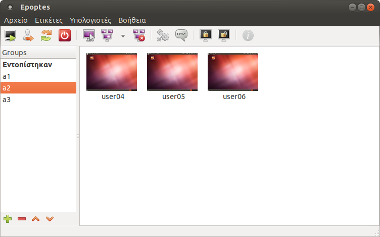

{: .right33}
Ένα σημαντικό κομμάτι της εφαρμογής είναι η
δημιουργία τάξεων. Με αυτόν τον τρόπο είναι εύκολο οι
καθηγητές/δάσκαλοι να διαχειρίζονται συγκεκριμένους
σταθμούς εργασίας σε ένα εργαστήριο. Παρακάτω θα αναλύσουμε τον
τρόπο με το οποίο μπορούμε να δημιουργήσουμε/διαγράψουμε Τάξεις
(Groups) και να προσθέσουμε/αφαιρέσουμε σταθμούς εργασίας σε αυτές.

Κατά την έναρξη της εφαρμογής την πρώτη φορά, όλοι οι σταθμοί εργασίας
που είναι ενεργοποιημένοι εμφανίζονται στην Τάξη (Group) ++"Εντοπίστηκαν"++.

{: .right33}
Από το εικονίδιο

μπορείτε να δημιουργήσετε μια καινούρια Τάξη. Μετά την επιλογή δημιουργίας στην λίστα Τάξεων
δημιουργείται μια νέα εγγραφή με όνομα ++"New group"++ όπως φαίνεται στην εικόνα
δεξιά σας, ενώ ταυτόχρονα ενεργοποιείται και η δυνατότητα εισαγωγής
κειμένου στην συγκεκριμένη εγγραφή με σκοπό την απόδοση επιθυμητού
ονόματος.

!!! tip "Συμβουλή"
    Η αλλαγή του ονόματος μιας Τάξης μπορεί να γίνει ανά πάσα στιγμή
     κάνοντας ++"διπλό κλικ"++ επάνω της.

Στις καινούριες Τάξεις δεν περιέχονται σταθμοί εργασίας. Για να
εισάγετε, αρκεί να σύρετε τον σταθμό εργασίας που επιθυμείτε από
την Τάξη ++"Εντοπίστηκαν"++ στην καινούρια Τάξη.

!!! info "Πληροφορία"
    Ο σταθμός εργασίας δεν αφαιρείται από την Τάξη ++"Εντοπίστηκαν"++.
    Απλώς, ο συγκεκριμένος σταθμός εργασίας θα εμφανίζεται
    και σε εκείνη την Ομάδα (Τάξη) που προσθέσατε τον σταθμό.

TODO: Content tabs - Bad pdf export

**Παράδειγμα εμφάνισης σταθμών εργασίας ("κλικ" στo αντίστοιχο "tab"):**

=== "Τάξη "a1""

    

=== "Τάξη "a2""

    

=== "Απενεργοποιημένων"

    

Όπως βλέπετε και στις προηγούμενες εικόνες, στο παράδειγμά μας, οι σταθμοί
εργασίας έχουν μοιραστεί σε τρεις διαφορετικές Τάξεις που έχουμε
δημιουργήσει. Με αυτό το τρόπο μπορείτε να διαχειρίζεστε τον ++"Επόπτης (Epoptes)"++
στην περίπτωση που η σχολική σας μονάδα διαθέτει έναν εξυπηρετητή
και δύο ή περισσότερα εργαστήρια. Ο κάθε καθηγητής μπορεί να σύρει
τους σταθμούς εργασίας που επιθυμεί στην Τάξη που έχει δημιουργήσει
και να τους διαχειρίζεται από εκεί, ανεξάρτητα από τους υπολοίπους
σταθμούς που έχουν εκκινήσει από τον συγκεκριμένο εξυπηρετητή και
ανήκουν σε άλλη Τάξη.

Η αφαίρεση ενός σταθμού από μια Τάξη επιτυγχάνεται διαλέγοντας από το
αναδυόμενο μενού (++"δεξί κλικ"++ στο εικονίδιο που αντιπροσωπεύει τον
σταθμό εργασίας) την επιλογή ++"Αφαίρεση από την ομάδα"++, ενώ από το εικονίδιο

πραγματοποιείται η διαγραφή της επιλεγμένης ομάδας.

Τέλος, με την προσθήκη των σταθμών εργασίας σε τάξεις μπορείτε να
εκμεταλλευτείτε και την δυνατότητα που προσφέρει η εφαρμογή για
εκκίνηση των σταθμών μέσω του δικτύου (Wake On LAN).

!!! info "Πληροφορία"
    Η συγκεκριμένη λειτουργία προϋποθέτει οι κάρτες δικτύου
    των σταθμών εργασίας να υποστηρίζουν Wake On LAN.

Πιο συγκεκριμένα, όταν οι σταθμοί εργασίας είναι απενεργοποιημένοι στις
αντίστοιχες Τάξεις που ανήκουν εμφανίζεται ένα εικονίδιο υπολογιστή με
ετικέτα την MAC διεύθυνση του. Αντιθέτως, στην ομάδα ++"Εντοπίστηκαν"++ δεν εμφανίζονται
αυτοί οι σταθμοί εργασίας.

!!! tip "Συμβουλή"
    Στην ομάδα ++"Εντοπίστηκαν"++ εμφανίζονται μόνο οι ενεργοποιημένοι σταθμοί εργασίας.

Επιλέγοντας τους απενεργοποιήμενους σταθμούς εργασίας και κάνοντας κλικ
στο εικονίδιο 
μπορείτε να τους εκκινήσετε.
