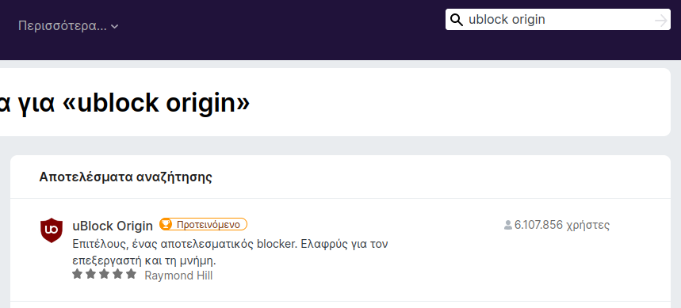
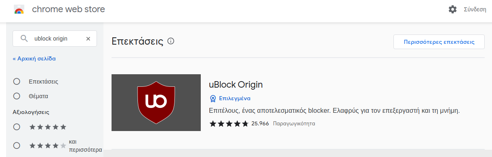
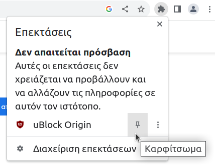

# Αποκλεισμός διαφημίσεων

## Θεωρία {#theory}

Τις περισσότερες φορές όταν πλοηγήστε στο διαδίκτυο, κατακλύζεστε από
ενοχλητικές διαφημίσεις οι οποίες, σε κάποιες περιπτώσεις, ίσως θέσουν σε
κίνδυνο την ασφάλεια των πληροφοριακών σας συστημάτων ή και να παραβιάσουν την
ιδιωτικότητά σας. Επίσης μπορούν να διασπάσουν την προσοχή των μαθητών, από το
περιεχόμενο που τους έχετε υποδείξει. Για να μπορέσετε να απαλλαγείτε από όλα
αυτά, θα πρέπει να εγκαταστήσετε κάποιο λογισμικό τύπου
[Ad blocking](https://en.wikipedia.org/wiki/Ad_blocking) -
[Internet filter](https://en.wikipedia.org/wiki/Internet_filter).

## uBlock Origin {#ublock}

Το λογισμικό [uBlock Origin](https://en.wikipedia.org/wiki/UBlock_Origin) είναι
πολύ αποδοτικό, καταναλώνει ελάχιστους πόρους από το υπολογιστικό σας σύστημα
και η εγκατάστασή του διαρκεί μερικά δευτερόλεπτα. Διατίθεται ως
[browser extension](https://en.wikipedia.org/wiki/Browser_extension) (επέκταση)
και για τους δύο δημοφιλείς περιηγητές, **Firefox** και **Google Chrome**. Θα
πρέπει όμως να γίνει **εγκατάσταση ανά χρήστη**. Δηλαδή πραγματοποιήστε είσοδο
στο λογαριασμό που σας ενδιαφέρει και ακολουθείστε τη διαδικασία εγκατάστασης
της επέκτασης, όπως περιγράφεται στη συνέχεια.

!!! tip "Σημαντικό"
    Επειδή η εγκατάσταση είναι ανά χρήστη, προτείνεται στα πλαίσια του
    μαθήματος, να γίνει από **τους ίδιους τους μαθητές** και να παροτρυνθούν να
    το εφαρμόσουν **και στους προσωπικούς τους υπολογιστές**.

## Firefox {#firefox}

Για να εγκαταστήσετε/προσθέσετε την επέκταση, αφού εκκινήσετε τον ***Περιηγητή
Firefox***, ακολουθείστε τα επόμενα βήματα:

1.  Πάνω δεξιά ***![≡][≡]*** ▸ ***Πρόσθετα και θέματα***, στο πεδίο ***Εύρεση
    περισσότερων προσθέτων*** πληκτρολογείστε `ublock origin` και **`Enter`**.

2.  Αν όλα έχουν πάει σωστά, θα δείτε το αποτέλεσμα της επόμενης εικόνας. Κάντε
    κλικ πάνω στην επέκταση.
    

3.  Στην συνέχεια επιλέξτε το ***Προσθήκη στο Firefox***. Στο παράθυρο που θα
    εμφανιστεί επιλέξτε ***Προσθήκη***.

4.  Τέλος εμφανίζεται ένα μήνυμα επιβεβαίωσης, ***Το uBlock Origin
    προστέθηκε***. Επιλέξτε ***![✔][✔]Να επιτρέπεται η εκτέλεσή του σε ιδιωτικά
    παράθυρα*** και ***Εντάξει***. Δεξιά από τη γραμμή διευθύνσεων θα δείτε
    "καρφιτσωμένο" το αντίστοιχο εικονίδιο.

!!! tip "Χρήσιμο"
    Αντί για τα βήματα 1-2, μπορείτε να εγκαταστήσετε την επέκταση απ' ευθείας
    από το URL της:
    <https://addons.mozilla.org/el/firefox/addon/ublock-origin/>

## Google Chrome {#chrome}

Για να εγκαταστήσετε/προσθέσετε την επέκταση, αφού εκκινήσετε τον ***Google
Chrome***, ακολουθείστε τα επόμενα βήματα:

1.  Πάνω δεξιά ***![⋮][⋮]*** ▸ ***Περισσότερα εργαλεία*** ▸ ***Επεκτάσεις***
    και στη συνέχεια πάνω αριστερά ***![≡][≡]*** ▸ ***Άνοιγμα του Chrome Web
    Store***. Στο πεδίο ***Αναζήτηση στο κατάστημα*** πληκτρολογείστε `ublock
    origin` και **`Enter`**.

2.  Αν όλα έχουν πάει σωστά, θα δείτε το αποτέλεσμα της επόμενης εικόνας. Κάντε
    κλικ πάνω στην επέκταση.
    

3.  Στην συνέχεια επιλέξτε το ***ΠΡΟΣΘΗΚΗ***. Στο παράθυρο που θα εμφανιστεί
    επιλέξτε ***Προσθήκη επέκτασης***.

4.  Τέλος εμφανίζεται ένα μήνυμα επιβεβαίωσης, ***Η επέκταση uBlock Origin
    προστέθηκε στο Chrome***. H ***Ενεργοποίηση συγχρονισμού...*** **δεν**
    είναι απαραίτητη να γίνει.

5.  
    Για να "καρφιτσώσετε" το uBlock Origin δεξιά από τη γραμμή διευθύνσεων,
    επιλέξτε πάνω δεξιά το εικονίδιο ***Επεκτάσεις*** και στη συνέχεια τη
    σχετική "πινέζα" όπως φαίνεται στη διπλανή εικόνα.

!!! tip clear "Χρήσιμο"
    Αντί για τα βήματα 1-2, μπορείτε να εγκαταστήσετε την επέκταση απ' ευθείας
    από το URL της:
    <https://chrome.google.com/webstore/detail/ublock-origin/cjpalhdlnbpafiamejdnhcphjbkeiagm>

[link-reference-definitions]: https://github.github.com/gfm/#link-reference-definitions
[✔]: ../../images/v.svg
[✖]: ../../images/x.svg
[⋮]: ../../images/ellipsis-v-icon.svg
[≡]: ../../images/hamburger-icon.svg
