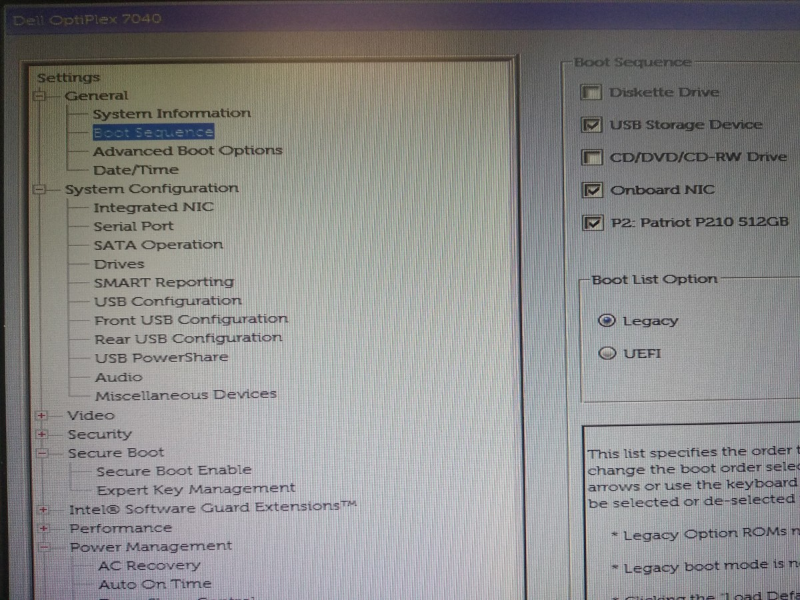
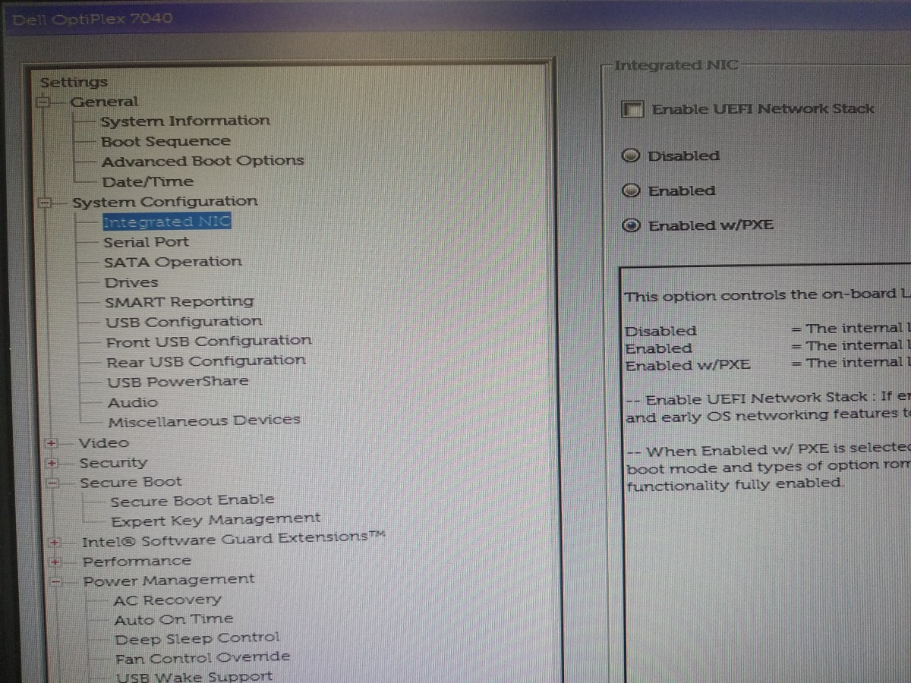
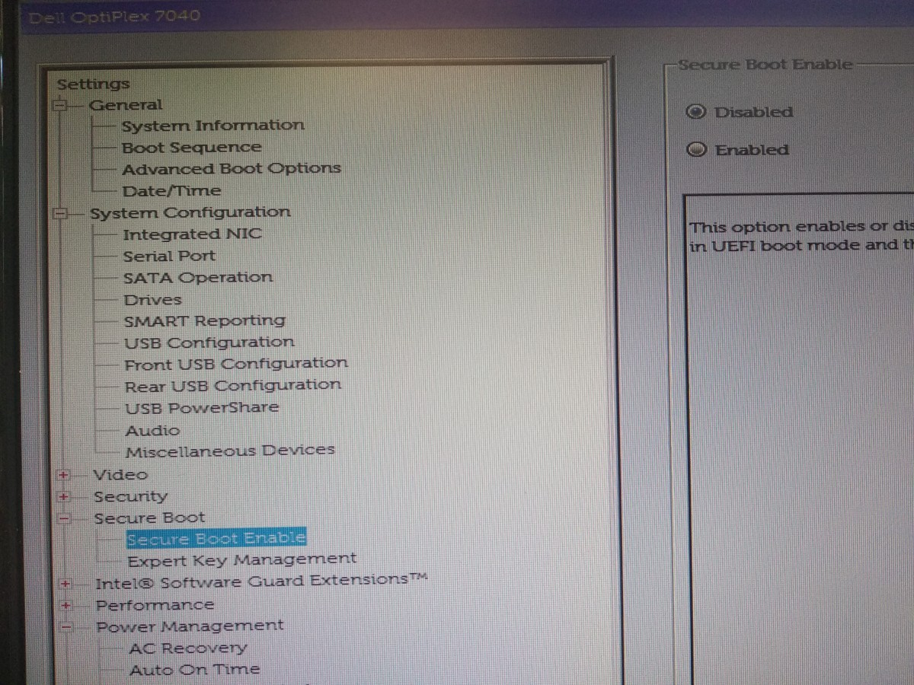
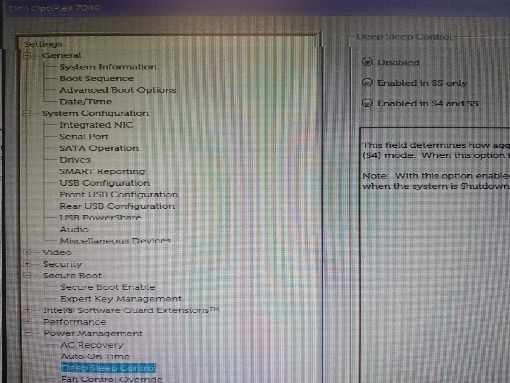
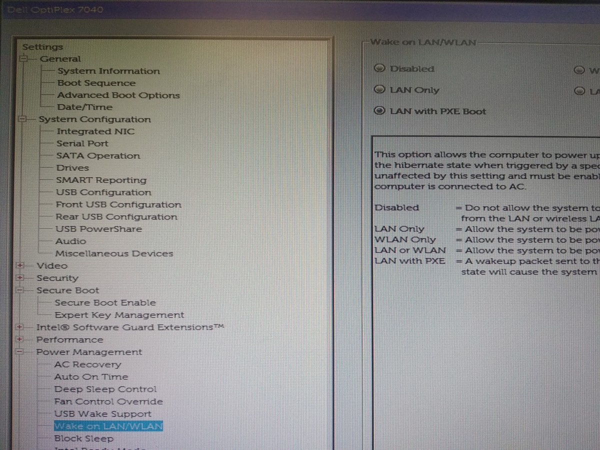

# Ρυθμίσεις δικτύου BIOS/UEFI

Στη σελίδα [Εκκίνηση από το δίκτυο](../../ltsp/netboot.md) αναφέρονται δύο
τρόποι ρύθμισης των σταθμών εργασίας ώστε να ξεκινάνε από το δίκτυο, είτε μέσω
του BIOS/UEFI είτε μέσω του προγράμματος iPXE. Εδώ περιγράφεται αναλυτικότερα η
περίπτωση του BIOS/UEFI, επειδή κάθε εταιρία έχει διαφορετικό μενού ρυθμίσεων.

Οι ρυθμίσεις που αναφέρονται έχουν την εξής έννοια:

1.  Είσοδος στις ρυθμίσεις BIOS/UEFI: εκκινούμε τον Η/Υ και πατάμε συνεχόμενα
    αυτό το πλήκτρο για να μπούμε στο BBIOS/UEFI.
2.  Ενεργοποίηση κάρτας δικτύου: πρέπει να είναι ***Enabled*** για να δουλέψει
    η onboard κάρτα.
3.  Ενεργοποίηση BIOS PXE: αν γίνει ***Enabled***, ο Η/Υ ξεκινάει από το δίκτυο
    σε κατάσταση BIOS.
4.  Ενεργοποίηση UEFI IPv4: αν γίνει ***Enabled***, ο Η/Υ ξεκινάει από το
    δίκτυο σε κατάσταση UEFI.
5.  Σειρά εκκίνησης: πρέπει να μπει πρώτη η εκκίνηση από κάρτα δικτύου.
6.  Secure boot: χρειάζεται να είναι απενεργοποιημένο για το LTSP.
7.  CSM: το ενεργοποιούμε αν θέλουμε να εκκινήσουμε νέο Η/Υ σε κατάσταση BIOS.
8.  Wake On LAN: για να μπορούμε να ξεκινάμε τους clients από τον Επόπτη.
9.  Deep Sleep: Αφορά τη διαχείριση ενέργειας και πρέπει να είναι
    απενεργοποιημένο για να λειτουργεί σωστά το Wake On LAN.
10. Αποθήκευση: συνήθως γίνεται με **`F10`** ▸ **`Enter`**.

Από τα (3) και (4), καλύτερα να προτιμήσουμε την κατάσταση που έχει
εγκατασταθεί το λειτουργικό που υπάρχει ήδη στο δίσκο. Π.χ. αν τα Windows είναι
σε UEFI, καλύτερα να ενεργοποιήσουμε το `UEFI IPv4` παρά το `BIOS PXE`. Έτσι αν
πατήσουμε **`Esc`** κατά την εκκίνηση του υπολογιστή, θα ακυρωθεί η εκκίνηση
από το δίκτυο και θα ξεκινήσουν τα Windows. Αντίθετα, αν είχαμε επιλέξει `BIOS
PXE` και πατούσαμε **`Esc`**, δεν θα ήταν δυνατή η μετάβαση σε UEFI mode ώστε
να ξεκινήσουν τα Windows.

!!! tip "Χρήσιμο"
    Για να λειτουργήσει σωστά το Wake On Lan (8) τερματίζουμε πρώτα το client
    φυσιολογικά, είτε από το μενού του συστήματος είτε μέσω Επόπτη.
    Επιβεβαιώνουμε ότι στο πίσω μέρος του η κάρτα δικτύου έχει αναμμένο το
    πορτοκαλί λαμπάκι.

## Lenovo V530S

Μοντέλα για τα οποία ισχύουν οι παρακάτω ρυθμίσεις:
[Lenovo V530S](https://www.lenovo.com/nz/en/desktops-and-all-in-ones/lenovo/v-series/Lenovo-V530S-07ICB-Desktop/p/11LV1VDV53S)

-   Είσοδος στις ρυθμίσεις UEFI: **`F1`**. Άλλα πλήκτρα: **`Enter`**: μενού,
    **`F10`**: diagnostics, **`F12`**: boot manager.
-   Ενεργοποίηση κάρτας δικτύου: ***Devices*** ▸ ***Network Setup*** ▸ ***Onboard
    Ethernet Controller***: ***Enabled*** (προεπιλεγμένο).
-   Ενεργοποίηση BIOS PXE: ***Devices*** ▸ ***Network Setup*** ▸ ***PXE Option
    ROM***: ***Enabled*** (προεπιλεγμένο).
-   Ενεργοποίηση UEFI IPv4: ***Devices*** ▸ ***Network Setup*** ▸ ***PXE IPV4
    Network Stack***: ***Enabled*** (προεπιλεγμένο).
-   Σειρά εκκίνησης: ***Startup*** ▸ ***Primary Boot Sequence*** ▸ ***Network
    1:*** ▸ **`Shift`**+**`+`**.
-   Secure boot: ***Security*** ▸ ***Secure Boot*** ▸ ***Secure Boot***:
    ***Disabled***.
-   CSM: ***Startup*** ▸ ***CSM*** ▸ ***Enabled***.
-   Wake On LAN: ***Power*** ▸ ***Automatic Power On*** ▸ ***Wake on LAN***:
    ***Automatic*** (προεπιλεγμένο).
-   Αποθήκευση: **`F10`** ▸ ***Yes***.

Παρατηρήσεις: εάν γίνει εκκίνηση με το Wake On LAN του Επόπτη, ενεργοποιείται
αυτόματα και η εκκίνηση από το δίκτυο του BIOS/UEFI!

## Dell OptiPlex 7040

-   Είσοδος στις ρυθμίσει BIOS/UEFI: **`F2`**.
-   
    Σειρά εκκίνησης: ***General*** ▸ ***Boot Sequence***. Στις επιλογές δεξιά,
    ορίστε ως 1η την αντιστοιχη κάρτα δικτύου.
-   
    Ενεργοποίηση κάρτας δικτύου: ***System Configuration*** ▸ ***Integrated
    NIC***. Δεξιά επιλέξτε: ***Enabled w/PXE***.
    {.clear}
-   
    Secure Boot: ***Secure Boot*** ▸ ***Secure Boot Enable***. Δεξιά επιλέξτε:
    ***Disabled***.
    {.clear}
-   
    Deep Sleep: ***Power Management*** ▸ ***Deep Sleep Control***. Δεξιά
    επιλέξτε: ***Disabled***.
    {.clear}
-   
    Wake On LAN: ***Power Management*** ▸ ***Wake on LAN/WLAN***. Δεξιά
    επιλέξτε: ***LAN with PXE Boot***.
    {.clear}

## Dell Vostro 3681

-   Όπως οι ρυθμίσεις του [Dell OptiPlex 7040](index.md#dell-optiplex-7040)
-   Προσοχή στο Deep Sleep να είναι ***Disabled***.
