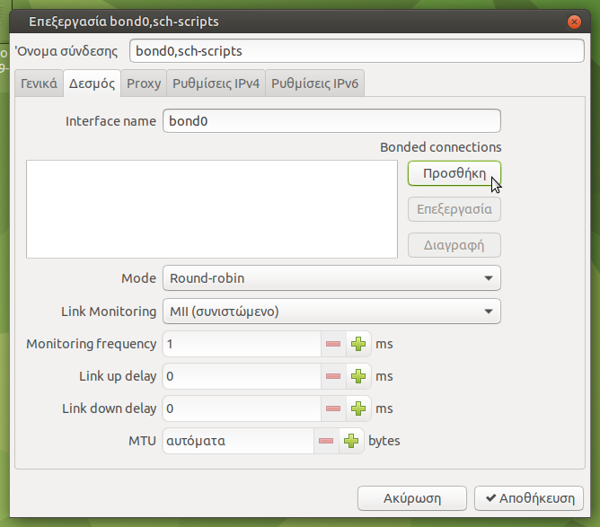
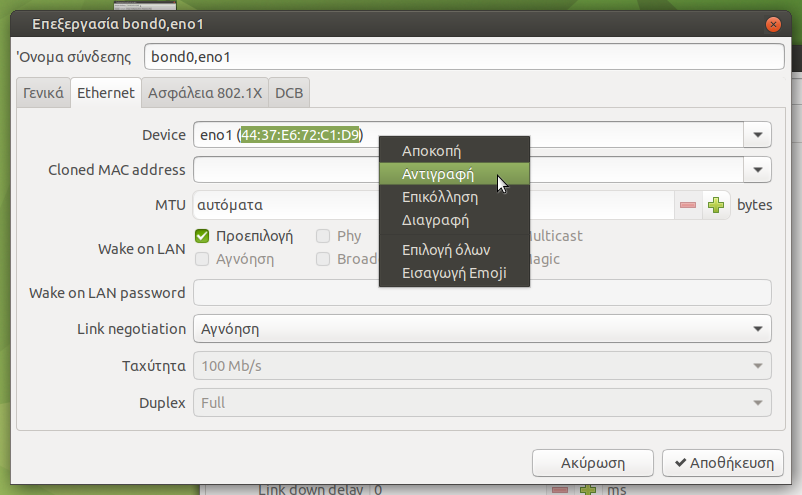
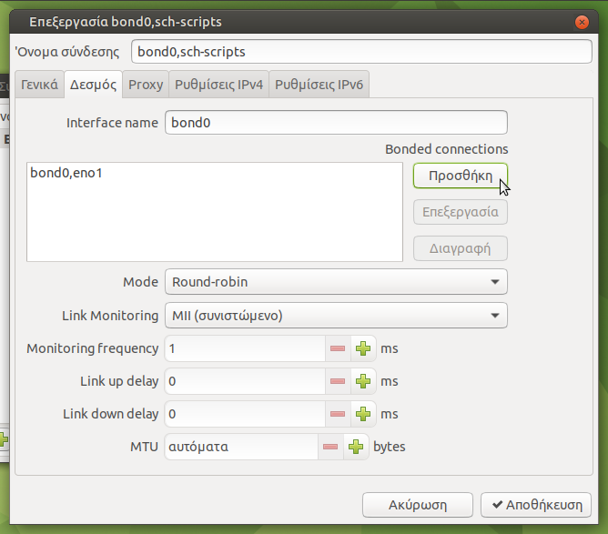
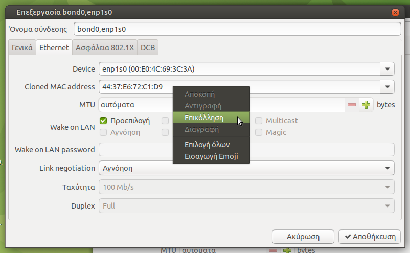
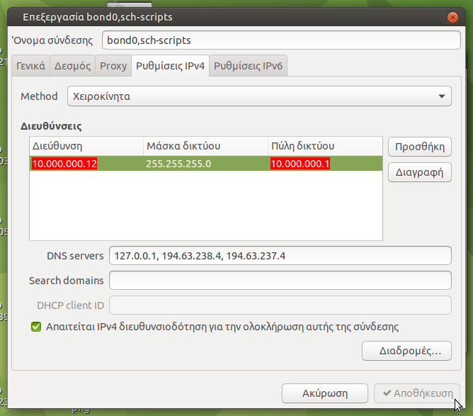
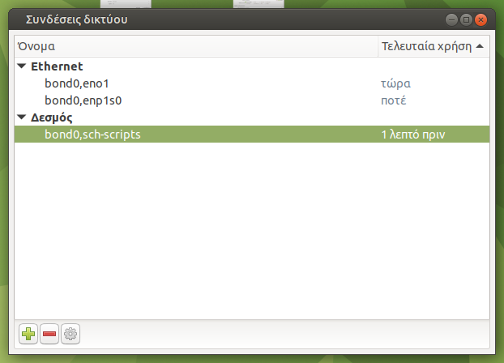

# Bonding

Όταν έχετε στον LTSP server **δύο κάρτες δικτύου** στα 1000 Mbps, μπορείτε να
τις ρυθμίσετε σε λειτουργία bonding, ώστε να έχετε **διπλάσια ταχύτητα
επικοινωνίας** (2 Gbps) μεταξύ του server και των clients. Το μόνο που πρέπει
να εξασφαλίσετε είναι και οι δύο κάρτες δικτύου να ειναι συνδεδεμένες **στο
ίδιο gigabit switch** του εργαστηρίου που είναι και τα clients.

## Ρυθμίσεις - Βήματα

1.  Στον LTSP server συνδέεστε ως `administrator` και στο εικονίδιο δικτύου
    κάνετε ***κλικ*** ▸ ***Επεξεργασία συνδέσεων...***.

2.  Στο παράθυρο ***Συνδεσεις δικτύου***, επιλέγετε κάτω αριστερά ***Προσθήκη
    νέας σύνδεσης*** (πράσινο +).

3.  Στην ***Επιλογή τύπου σύνδεσης*** επιλέγετε ***Δεσμός*** και
    ***Create...***.

4.  
    Στο επόμενο παράθυρο ορίζετε το ***Όνομα σύνδεσης*** σε `bond0,sch-scripts`
    και επιλέγετε ***Προσθήκη***, όπως φαίνεται στη διπλανή εικόνα.
    {.clear}

5.  Στην ***Επιλογή τύπου σύνδεσης*** επιλέγετε ***Ethernet*** και
    ***Create...***.
    {.clear}

6.  
    Στο παράθυρο που θα εμφανιστεί ορίζετε το ***Όνομα σύνδεσης*** σε
    `bond0,eno1` και στο ***Device*** επιλέγετε ***eno1 (xx:xx:xx:xx:xx:xx)***.
    Μαρκάρετε τη MAC address και με ***δεξί κλικ*** ▸ ***Αντιγραφή***, την
    αντιγράφετε στο "πρόχειρο". Στην συνέχεια ***Αποθήκευση***. Δείτε συνολικά
    το βήμα στη διπλανή εικόνα.
    {.clear}

7.  
    Επανέρχεστε στο παράθυρο με τις ***Bonded connections*** όπου θα δείτε οτι
    προστέθηκε η `bond0,eno1` που μόλις δημιουργήσατε. Επιλέγετε ξανά
    ***Προσθήκη***, όπως φαίνεται στη διπλανή εικόνα.
    {.clear}

8.  Στην ***Επιλογή τύπου σύνδεσης*** επιλέγετε ξανά ***Ethernet*** και
    ***Create...***.
    {.clear}

9.  
    Στο παράθυρο που θα εμφανιστεί ορίζετε το ***Όνομα σύνδεσης*** σε
    `bond0,enp1s0` και στο ***Device*** επιλέγετε ***enp1s0
    (xx:xx:xx:xx:xx:xx)***. Στο πεδίο ***Cloned MAC address*** κάνετε ***δεξί
    κλικ*** ▸ ***Επικόλληση***, τη MAC address που είχατε αντιγράψει στο
    "πρόχειρο" (βήμα 6). Στην συνέχεια επιλέξτε ***Αποθήκευση***. Δείτε
    συνολικά το βήμα στη διπλανή εικόνα.
    {.clear}

10. Στο παράθυρο με τις ***Bonded connections*** θα δείτε οτι κάτω από την
    `bond0,eno1` προστέθηκε και η `bond0,enp1s0` που μόλις δημιουργήσατε.

11. 
    Χωρίς να κλείσετε το παράθυρο, επιλέγετε την "καρτέλα" ***Ρυθμίσεις IPv4***
    στην οποία ρυθμίζετε στατική ή δυναμική IP, DNS servers `127.0.0.1,
    194.63.238.4, 194.63.237.4`, ανάλογα τι επιθυμείτε. Να **επιλέξετε** και το
    ***Απαιτείται IPv4 διευθυνσιοδότηση για την ολοκλήρωση αυτής της
    σύνδεσης***. Στο τέλος ***Αποθήκευση***. Στο διπλανό σχήμα βλέπετε συνολικά
    τις ρυθμίσεις για στατικη IP. Όπου `10.161.254.11` και `10.161.254.1` να
    βάλετε τις αντίστοιχες IP του υποδικτύου σας.
    {.clear}

12. 
    Από το παράθυρο ***Συνδέσεις δικτύου*** διαγράψτε τις υπόλοιπες συνδέσεις
    ώστε στο τέλος να μείνουν οι δύο ***Ethernet*** και η μία ***Δεσμός***,
    όπως φαίνονται στη διπλανή εικόνα.
    {.clear}

13. Επανεκκινήστε τον LTSP server, στη συνέχεια τα clients και [ελέγξτε την
    ταχύτητα του δικτύου σας](../../epoptes/lan-benchmark.md).
    {.clear}

!!! warning "Σημαντικό"
    Αν στις δοκιμές που θα κάνετε δεν καταφέρετε να δείτε ταχύτητες **συνολικής
    αποστολής** αλλά και **λήψης** πάνω απο 1 Gbps τότε επεξεργαστείτε τη
    σύνδεση ***bond0,sch-scripts*** (βήμα 1) και αλλάξτε το ***Mode*** της bond
    σύνδεσης από ***Round-robin*** σε ***XOR***. Μετά την αλλαγή επιλέξτε
    ***Αποθήκευση*** και από το εικονίδιο δικτύου απενεργοποιήστε και ξανά
    ενεργοποιήστε την ***Ενεργοποίηση δικτύωσης***. **Χωρίς** να κάνετε
    επανεκκίνηση server/clients, ελέγξτε ξανά την ταχύτητα του δικτύου σας.
