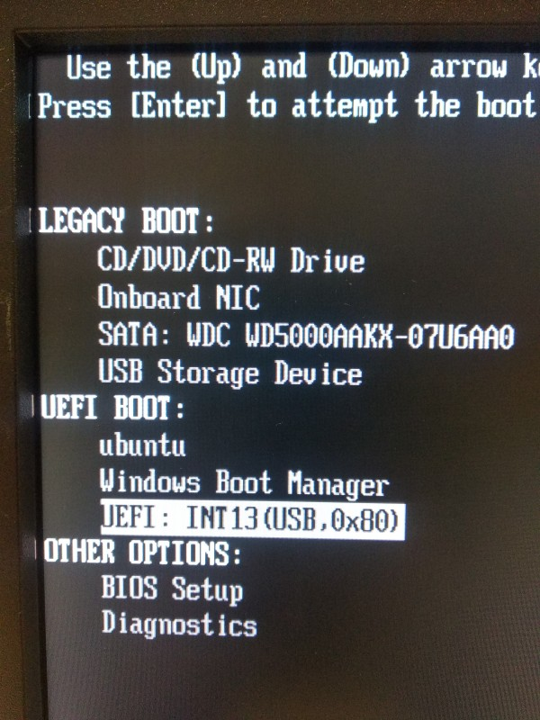

# Εκκίνηση σε κατάσταση BIOS ή UEFI

Πολλές φορές θα χρειαστείτε να εκκινήσετε το σύστημα σας από [live USB
stick](../../ubuntu/liveusb/), είτε για την εγκατάσταση λειτουργικού
συστήματος, είτε για κάποιες εργασίες επιδιόρθωσης. Σε αυτές τις περιπτώσεις θα
πρέπει να γνωρίζετε, σε τι κατάσταση/mode έχετε εκκινήσει το σύστημά σας, BIOS
ή UEFI.

## Έλεγχοι

1.  Σε περίπτωση που το USB stick **δεν αναγνωρίζεται** από το σύστημά σας, θα
    πρέπει να εμφανίσετε τον boot manager ώστε να το επιλέξετε. Δοκιμάστε το
    πλήκτρο **`F12`**. Αν η δοκιμή δεν είναι επιτυχής δοκιμάστε να το επιλέξετε
    μέσα από τις ρυθμίσεις του BIOS/UEFI, πατώντας το πλήκτρο **`Del`**. Αν οι
    δοκιμές είναι ανεπιτυχείς μπορείτε να κάνετε σχετική αναζήτηση του
    συστήματος σας στο διαδίκτυο.

    [](Dell_OptiPlex_390_UEFI.jpg)
    !!! tip "Χρήσιμο"

        Είναι πιθανό το USB stick να εμφανιστεί δύο φορές στον boot
        manager, για παράδειγμα:

        -   ***USB DISK 2.0 (7388MB)***: για εκκίνηση σε κατάσταση BIOS, και
        -   ***UEFI: USB DISK 2.0 (7388MB)***: για εκκίνηση σε κατάσταση UEFI.

        Επιλέγετε αυτό που επιθυμείτε. Στη διπλανή εικόνα βλέπουμε ένα παράδειγμα
        από Dell OptiPlex 390. Η επιλογή ***USB Storage Device*** είναι για **BIOS mode**.

2.  Στη συνέχεια ανάλογα πως έχει δημιουργηθεί το USB stick, ίσως εμφανιστεί
    μενού ώστε να επιλέξετε το Λ.Σ. που θέλετε. Εκεί πριν επιλέξετε το
    αντίστοιχο `.iso` ελέγξτε το mode στο οποίο βρίσκεστε:

    -   Στην περίπτωση του [LiveUSB](../../ubuntu/liveusb.md#liveusb) θα
        εμφανιστεί μενού GNU GRUB στο οποίο θα υπάρχει ή επιλογή ***Enter
        UEFI setup*** ή ***Boot DOS*** (BIOS).
    -   Αν έχετε χρησιμοποιήσει το
        [Ventoy](../../ubuntu/liveusb.md#ventoy), στο μενού του κάτω
        αριστερά, θα υπάρχει ή ένδειξη ***UEFI*** ή ***BIOS***.

3.  Από το live περιβάλλον του Ubuntu επιβεβαιώνετε αν το USB stick είναι σε
    κατάσταση UEFI ή BIOS. Από [τερματικό](../../glossary#terminal):
    ```shell
    ls /sys/firmware/efi
    ```
    Αν ο κατάλογος **υπάρχει**, είσαστε σε κατάσταση **UEFI**, διαφορετικά σε
    **BIOS**.

4.  Αν υπάρχει/ουν εγκατεστημένο/α Λ.Σ. για να διαπιστώσετε σε τι κατάσταση
    είναι, από [τερματικό](../../glossary#terminal):
    ```shell
    sudo parted -l
    ```
    Αν το `Partition Table` είναι: `gpt`, τότε το Λ.Σ. είναι σε **UEFI** mode,
    ενώ αν το `Partition Table` είναι: `msdos`, τότε είναι σε **BIOS** mode.
