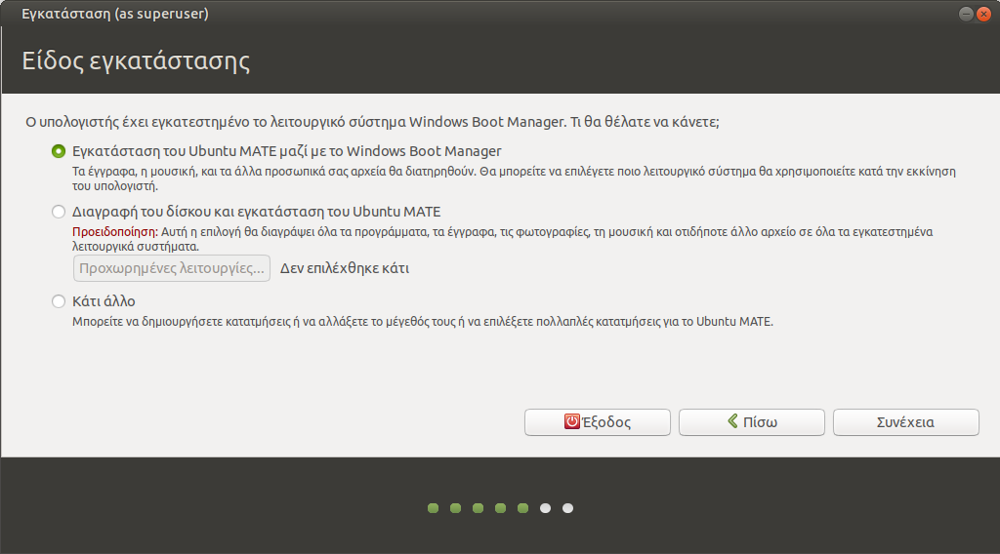

# Ubuntu με UEFI Windows

Όταν έχετε υπολογιστή με προεγκατεστημένα τα Windows 10, αυτά συνήθως είναι σε
UEFI mode. Σε αυτήν την περίπτωση, αν δε θέλετε να διαγράψατε τα Windows, θα
πρέπει να εγκαταστήσετε και το Ubuntu σε κατάσταση/mode UEFI.

## Βήματα

1.  Ακολουθείτε τον οδηγό [Εκκίνηση σε κατάσταση BIOS ή
    UEFI](../../guides/bios-uefi-boot/index.md) ώστε να εξασφαλίσετε ότι το
     live USB stick - με το οποίο θα εκκινήσετε το σύστημά σας - αλλά και τα
    ήδη εγκατεστημένα Windows, ειναι σε κατάσταση UEFI.

    !!! warning "Προσοχή"
        Αν η κατάσταση των Windows δεν ταιριάζει με την κατάσταση που μπούταρε
        το live USB stick, τότε δεν προχωράτε σε εγκατάσταση.

2.  [](type-of-installation.png) Ακολουθείτε τα
    βήματα [Εγκατάσταση του Ubuntu](../../ubuntu/installation.md). Στο βήμα
    εγκατάστασης ***Διατήρηση του περιβάλλοντος Microsoft Windows***, στην
    περίπτωση των UEFI Windows, επιλέγουμε ***Εγκατάσταση του Ubuntu MATE μαζί
    με το Windows Boot Manager*** όπως φαίνεται στη διπλανή εικόνα.

## Υλοποιήσεις UEFI dual boot

### Lenovo ThinkCentre M91p

Οι οδηγίες εφαρμόστηκαν σε υπολογιστή **Lenovo ThinkCentre M91p** με
προεγκατεστημένα UEFI Windows 10. Μετά την ολοκλήρωση της εγκατάστασης, δεν
εμφανιζόταν ο GRUB και γινόταν απ' ευθείας boot στα Windows.

Διαπιστώθηκε ότι το UEFI στο συγκεκριμένο pc είναι προβληματικό. Αντί να
φορτώνει οποιοδήποτε UEFI λειτουργικό, δηλαδή το αρχείο
`\EFI\Boot\BOOTX64.EFI`, φόρτωνε μόνο Windows, δηλαδή το αρχείο
`\EFI\Microsoft\Boot\bootmgfw.efi`.

Για να παρακαμφθεί το πρόβλημα εφαρμόστηκε το ακόλουθο workaround. Αφού
bootάρουμε με το live USB stick σε UEFI mode, από
[τερματικό](../../glossary/index.md#terminal):

```shell-session
sudo -i
lsblk --fs
mount /dev/sda2 /mnt
cd /mnt/EFI/Microsoft/Boot/
mv bootmgfw.efi bootmgfw-real.efi
cp -a ../../ubuntu/grubx64.efi bootmgfw.efi
cd /
umount /mnt
mount /dev/sda5 /mnt
# Στα περιεχόμενα του grub.cfg, αλλαγή του bootmgfw.efi σε bootmgfw-real.efi
nano /mnt/boot/grub/grub.cfg
umount /mnt
sync;reboot
```

Επειδή όμως σε κάθε update-grub (kernel update) αυτή η αλλαγή ονόματος επανέρχεται σε `bootmgfw.efi`, θα πρέπει να τρέχουμε την εντολή:

```shell
sudo sed 's/bootmgfw.efi/bootmgfw-real.efi/g' -i /boot/grub/grub.cfg
```
