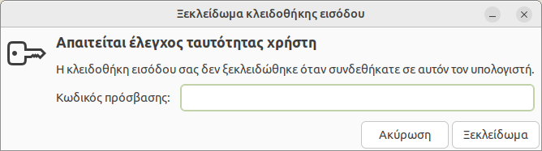
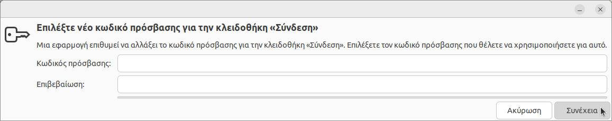

# Κλειδοθήκη

## Πρόβλημα

Όταν ανοίγετε τον **Google Chrome**, εμφανίζεται το ακόλουθο παράθυρο.


Αυτό συνήθως συμβαίνει γιατί κάνατε τις ακόλουθες ενέργειες:

1.  Πραγματοποιήσατε τουλάχιστον μία φορά, σύνδεση με username/password π.χ.
    `guest01`/`guest01`.

2.  Στη συνέχεια ορίσατε να γίνεται [AUTOLOGIN](../../ltsp/dm.md#autologin) o
    `guest01` (χωρίς χρήση password).

## Ανάλυση

Όταν πραγματοποιείτε είσοδο στο Ubuntu με username/password π.χ.
`guest01`/`guest01`, το σύστημα αυθεντικοποίησης του Linux, που λέγεται PAM,
εκτελεί δύο ενέργειες:

1.  Εγκρίνει το login.

2.  Ξεκλειδώνει την κλειδοθήκη (keyring).

Αν στη συνέχεια για το συγκεκριμένο χρήστη, ορίσετε να γίνεται `AUTOLOGIN`,
δηλαδή χωρίς χρήση password, το PAM θα ολοκληρώνει μόνο την 1η ενέργεια
(έγκριση login). Η 2η ενέργεια (ξεκλείδωμα κλειδοθήκης) δε θα γίνεται, γιατί το
PAM ποτέ δε θα έχει το αντίστοιχο password του χρήστη.

Η συνέπεια αυτού είναι, κάθε φορά που κάποιο πρόγραμμα, όπως π.χ. ο **Google
Chrome**, χρειάζεται πρόσβαση στην κλειδοθήκη, να σας ζητάει το password του
αντίστοιχου χρήστη για να την ξεκλειδώσει.

## Λύση

Η λύση είναι να αποθηκεύονται τα κλειδιά σε ιδιωτικό αρχείο, που δε θα έχουν
πρόσβαση άλλοι χρήστες, αλλά χωρίς κλειδί κρυπτογράφησης. Αυτό θα έχει ως
αποτέλεσμα, κάθε φορά που κάποιο πρόγραμμα χρειάζεται πρόσβαση στην κλειδοθήκη,
να μη σας ζητάει το password του χρήστη.

Πραγματοποιήστε είσοδο στο λογαριασμό που σας ενδιαφέρει π.χ. `guest01` και
ακολουθείστε τα επόμενα βήματα, δηλαδή τα εφαρμόζετε **ανά χρήστη**:

1.  ***Εφαρμογές*** ▸ ***Βοηθήματα*** ▸ ***Κωδικοί πρόσβασης και κλειδιά*** ή
    από [τερματικό](../../glossary/index.md#terminal):

    ```shell
    seahorse
    ```

2.  Πάνω αριστερά ***<*** ▸ ***δεξί κλικ στο Σύνδεση*** ▸ ***Αλλαγή κωδικού
    πρόσβασης***.

3.  Στο πεδίο ***Κωδικός πρόσβασης*** που θα εμφανιστεί, εισάγετε τον κωδικό
    πρόσβασης του χρήστη π.χ. `guest01` και ***Συνέχεια***.

4.  Στο επόμενο παράθυρο, **δεν εισάγετε κωδικούς** και επιλέγετε
    ***Συνέχεια***, όπως φαίνεται στην επόμενη εικόνα.
    

5.  Στην ερώτηση ***Αποθήκευση κωδικών πρόσβασης χωρίς κρυπτογράφηση;***
    επιλέγετε ***Συνέχεια***. Τέλος κλείστε το αρχικό παράθυρο.

!!! tip "Χρήσιμο"
    Μπορείτε να διαγράψετε τελείως τις υπάρχουσες κλειδοθήκες, ώστε όταν
    ζητηθεί πρόσβαση στην κλειδοθήκη να οριστεί εκ νέου password. Δείτε τη
    σχετική τεκμηρίωση:
    [Εντολές διαγραφής](../../ltsp/run-commands.md#delete-commands).
