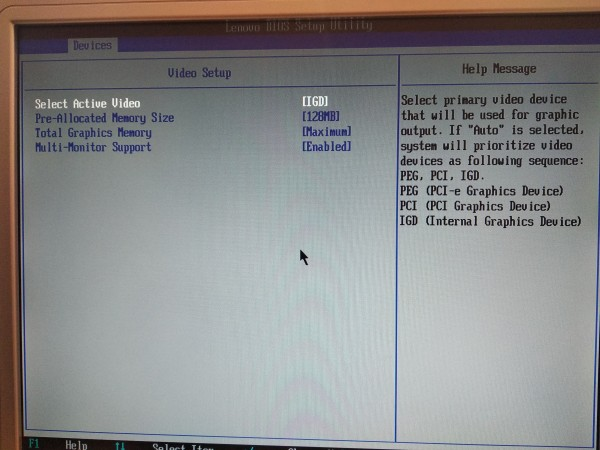

# Multiseat

Το multiseat LTSP έχει δοκιμαστεί για αρκετά χρόνια σε γραφεία και άλλα επαγγελματικά περιβάλλοντα, οπότε είναι σταθερότατο ώστε να το προτείνουμε και για σχολεία.

Multiseat σημαίνει **μία κεντρική μονάδα Η/Υ**, με **2 κάρτες γραφικών**, 2
οθόνες, 2 πληκτρολόγια και 2 ποντίκια, ώστε να προσφέρει 2 θέσεις εργασίας.
Έτσι χρειαζόμαστε τις μισές πρίζες δικτύου και μερικές λιγότερες ρεύματος,
προσφέροντας έτσι π.χ. 12 θέσεις εργασίας με 6 μόνο κεντρικές μονάδες Η/Υ.

!!! warning "Προσοχή"
    Απαιτείται **δεύτερη κάρτα γραφικών**, δε μας κάνει η δεύτερη έξοδος μίας μόνο κάρτας γραφικών.

## Βήματα εγκατάστασης

Τα βήματα που πρέπει να ακολουθήσουμε αφορούν **κυρίως** τον έλεγχο
"συμβατότητας" των clients:

1.  [](multiseat.jpg) Καταρχάς πριν προμηθευτούμε - αν δεν
    έχουμε - έξτρα κάρτες γραφικών θα πρέπει να δούμε αν στο BIOS υπάρχουν
    σχετικές επιλογές για multiseat όπως: **Active Video, Multi-Monitor
    Support, Internal Graphics Device (IGD), PCI Graphics Device (PCI), PCI -e
    Graphics Device (PEG)**. Δείτε τη διπλανή φώτο.

2.   Αφού τοποθετηθεί η κάρτα γραφικών και αφού γίνουν οι σχετικές ρυθμίσεις
     στο BIOS (βήμα 1), ΧΩΡΙΣ να έχουμε τοποθετήσει έξτρα
     οθόνη/πληκτρολόγιο/ποντίκι, εκκινούμε τον client.

3.  Από τον LTSP server: ***Επόπτη*** ▸ ***Δεξί κλικ στον client*** ▸
    ***Εκτέλεση*** ▸ ***Άνοιγμα κονσόλας*** ▸ ***Διαχειριστή, τοπικά*** και
    εκτελούμε την εντολή: `lspci -nn -k | grep -A 2 VGA`

4.  Αν το αποτέλεσμα του βήματος 3 είναι το ακόλουθο, η έξτρα κάρτα γραφικών
    π.χ. **Radeon HD 4550** έχει αναγνωριστεί:

    ```shell-session
    # lspci -nn -k | grep -A 2 VGA
    00:02.0 VGA compatible controller [0300]: Intel Corporation 2nd Generation Core Processor Family Integrated Graphics Controller [8086:0102] (rev 09)
            DeviceName:  Onboard IGD
            Subsystem: Lenovo 2nd Generation Core Processor Family Integrated Graphics Controller [17aa:3070]
    --
    01:00.0 VGA compatible controller [0300]: Advanced Micro Devices, Inc. [AMD/ATI] RV710 [Radeon HD 4550] [1002:9540]
            Subsystem: Advanced Micro Devices, Inc. [AMD/ATI] RV710 [Radeon HD 4550] [1002:0104]
            Kernel driver in use: radeon
    ```

5.  Αν όμως το αποτέλεσμα του βήματος 3 είναι το ακόλουθο, τότε η έξτρα κάρτα
    **ΔΕΝ ΕΧΕΙ ΑΝΑΓΝΩΡΙΣΤΕΙ**:

    ```shell-session
    # lspci -nn -k | grep -A 2 VGA
    00:02.0 VGA compatible controller [0300]: Intel Corporation 2nd Generation Core Processor Family Integrated Graphics Controller [8086:0102] (rev 09)
            DeviceName:  Onboard IGD
            Subsystem: Lenovo 2nd Generation Core Processor Family Integrated Graphics Controller [17aa:3070]
    ```

    !!! warning "Προσοχή"
        Στην περίπτωση που ΔΕΝ ΕΧΕΙ ΑΝΑΓΝΩΡΙΣΤΕΙ, δε συνεχίζουμε στα επόμενα
        βήματα.

6.  Αν έχει αναγνωριστεί (βήμα 4) τότε στο
    [ltsp.conf](../../ltsp/ltsp.conf.md) προσθέτουμε την ακόλουθη
    οδηγία:

    ```text title="ltsp.conf"
    [clients]
    MULTISEAT=1
    ```

7.  Στη συνέχεια: [ltsp initrd](../../ltsp/ltsp-commands.md#-ltsp-initrd) και
    **επανεκκίνηση** του client.

    !!! tip "Συμβουλή"
        Πριν την επανεκκίνηση μπορούμε να προσθέσουμε ΜΟΝΟ ΤΗΝ ΟΘΟΝΗ.

8.  Αν έχουν πάει όλα καλά, θα δούμε δυο ξεχωριστές login screen. Τώρα μπορούμε
    να προσθέσουμε USB πληκτρολόγιο/ποντίκι. Επειδή γίνεται αυτόματος
    διαχωρισμός μονές/ζυγές θέσεις (USB) για κάθε θέση εργασίας, θα πρέπει ενώ
    είναι σε λειτουργία οι δύο θέσεις εργασίας να δοκιμάσετε τις USB μέχρι να
    δείτε ότι το κάθε πληκτρολόγιο/ποντίκι έχει διαχωριστεί για κάθε θέση
    εργασίας.

9.   Σε περίπτωση που είχαμε ενεργοποιήσει να γίνεται
     [AUTOLOGIN](../../ltsp/dm.md#autologin) θα πρέπει στο
     [ltsp.conf](../../ltsp/ltsp.conf.md) κάτω από την αντίστοιχη MAC
     address να προσθέσουμε την ακόλουθη οδηγία έτσι ώστε να ισχύει και για τις
     δύο - πλέον - θέσεις εργασίας:

    ```text title="ltsp.conf"
    [ma:ca:dd:re:ss:03]
    HOSTNAME=pc03
    POST_INIT_LIGHTDM_CONF="printf '[Seat:seat0]\nautologin-user=guest03\n\n[Seat:seat-1]\nautologin-user=guest10\n' >> /etc/lightdm/lightdm.conf"
    ```

    !!! info "Πληροφορία"
        Το προηγούμενο παράδειγμα αφορά το client με `hostname=pc03` στο οποίο θα κάνει `autologin` o χρήστης `guest03` και ο χρήστης `guest10`.
        Πάντα μετά από αλλαγές στο ltsp.conf: `ltsp initrd`

## Υλοποιήσεις multiseat

Έγιναν υλοποιήσεις/δοκιμές με τα εξής αποτελέσματα:

| α/α |          Client         | Υποστήριξη από BIOS |
|:---:|:-----------------------:|:-------------------:|
|  1  |    Dell OptiPlex 390    |          ❌         |
|  2  |     HP Compaq dc7900    |          ❌         |
|  3  | Lenovo ThinkCentre M91p |          ✅         |

✅ : Επιτυχής υλοποίηση, ❌ : Ανεπιτυχής υλοποίηση

!!! info "Πληροφορία"
    Στις υλοποιήσεις 1-3 χρησιμοποιήθηκαν οι εξής video cards Low Profile (LP/SFF):

    1.  [VGA REF RADEON X600 128MB PCIE DVI LP](https://cosmodata.gr/product/166873/)
    2.  [ATI 4550 512MB PCI-E Low Profile](https://cosmodata.gr/product/317420/)
        (Ο αντάπτορας που τη συνοδεύει είναι λειτουργικός)
