# Αναβάθμιση σε νέο Ubuntu

Τον Απρίλιο κάθε ζυγού έτους εκδίδεται νέα έκδοση Long Term Support του Ubuntu,
για παράδειγμα Ubuntu 24.04 LTS. Λίγους μήνες μετά, τον Αύγουστο, εκδίδεται η
υποέκδοση 24.04.1 και **τότε** ενεργοποιείται η δυνατότητα αναβαθμίσεων από
από την προηγούμενη έκδοση Ubuntu 22.04.5 LTS.

Για να αναβαθμίσετε από Ubuntu MATE 22.04 σε 24.04, ακολουθήστε τις παρακάτω
οδηγίες. Για παλιότερες εκδόσεις π.χ. 18.04 προτείνεται να μην γίνει αναβάθμιση
αλλά καθαρή εγκατάσταση.

## Η αναβάθμιση του Ubuntu LTS είναι διαθέσιμη

[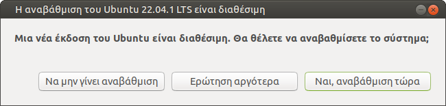](upgrade-01-available.png)Θα ειδοποιηθείτε ότι η
αναβάθμιση είναι διαθέσιμη με τον διάλογο που φαίνεται δεξιά. Αν για κάποιον
λόγο δεν εμφανιστεί αυτόματα, η εντολή τερματικού που εμφανίζει τον διάλογο
είναι `sudo update-manager -c`. Πατήστε **`Ναι, αναβάθμιση τώρα`**.

Ένα εναλλακτικό πρόγραμμα εγκατάστασης που τρέχει σε τερματικό αντί να
εμφανίζει γραφικούς διαλόγους ανοίγει με την εντολή `sudo do-release-upgrade`,
αλλά δεν έχετε λόγο να το προτιμήσετε.

## Σημειώσεις έκδοσης

[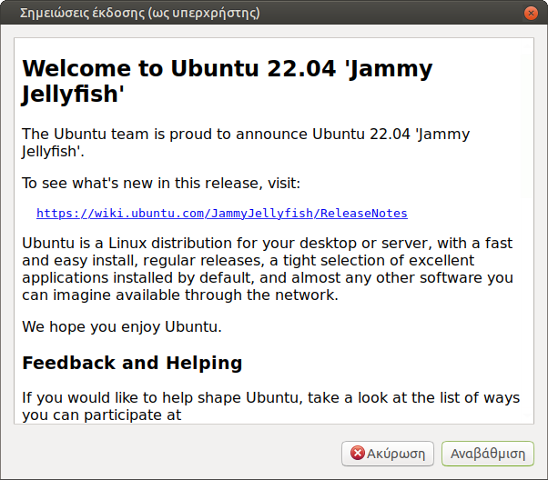](upgrade-02-notes.png)Ενημερωθείτε για τις αλλαγές
που επιφέρει το νέο Ubuntu και πατήστε το κουμπί **`Αναβάθμιση`**.

## Απενεργοποιήθηκαν πηγές τρίτων

[](upgrade-03-sources.png)Κατά την αναβάθμιση,
απενεργοποιούνται όλες οι "πηγές τρίτων" και παραμένουν μόνο αυτές του Ubuntu.
Έτσι τα sch-scripts, το skype, ο google-chrome και οτιδήποτε άλλο έχετε
εγκαταστήσει εκτός των αποθετηρίων του Ubuntu, πλέον δεν θα λαμβάνουν
αναβαθμίσεις.

Μια λύση σε αυτό το πρόβλημα είναι αφού ολοκληρωθεί η αναβάθμιση, να
ξαναεγκαταστήσετε όλα αυτά τα προγράμματα, ώστε να δημιουργηθούν εκ νέου τα
αρχεία πηγών που θα ανταποκρίνονται στη νέα έκδοση Ubuntu.

Πατήστε **`Κλείσιμο`** για να συνεχίσετε.

## Αναβάθμιση διανομής

[](upgrade-04-progress.png)Στον επόμενο διάλογο
φαίνονται τα βήματα προετοιμασίας για την αναβάθμιση.

## Θέλετε να ξεκινήσετε την αναβάθμιση

[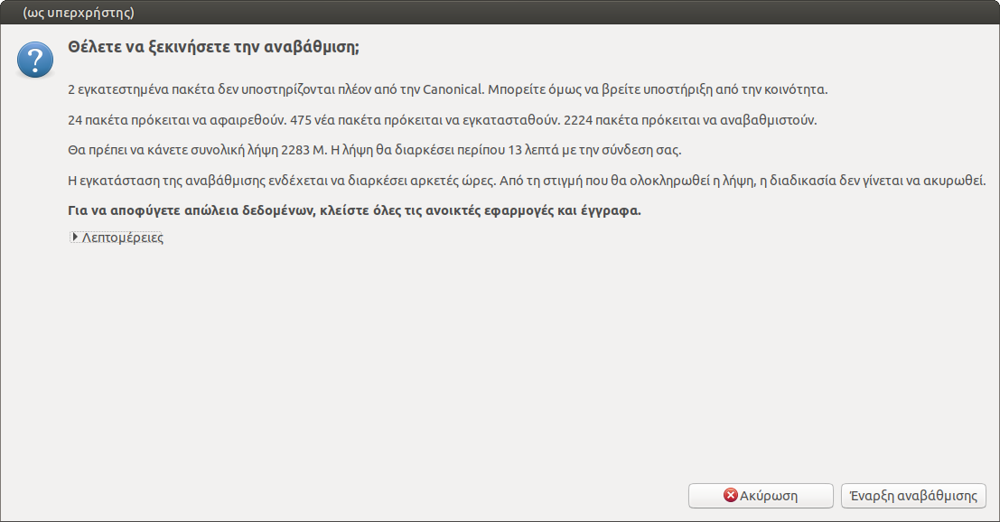](upgrade-05-confirmation.png)Κλείστε όλες τις
ανοικτές εφαρμογές και έγγραφα και πατήστε **`Έναρξη αναβάθμισης`**. Αυτή είναι
η τελευταία ευκαιρία να ακυρώσετε την αναβάθμιση εάν το επιθυμείτε.

## Unable to disable lock screen

[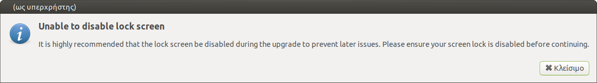](upgrade-06-lock-screen.png)Πατήστε
**`Κλείσιμο`** στο διάλογο που προειδοποιεί ότι δεν ήταν δυνατή η
απενεργοποίηση του κλειδώματος οθόνης.

## Λήψη πακέτων

[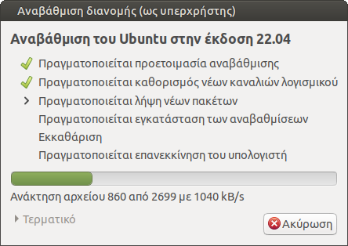](upgrade-07-progress.png)Ακολουθεί το πιο
χρονοβόρο μέρος της αναβάθμισης, η λήψη και η εγκατάσταση των νέων πακέτων.
Ευκαιρία για καφέ!

## Ρύθμιση του firefox

[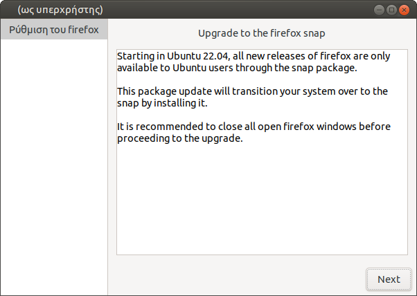](upgrade-08-firefox.png)Η αναβάθμιση ειδοποιεί ότι
το firefox θα μεταβεί στην έκδοση .snap αντί για .deb. Πατήστε **`Next`**.
Αργότερα, τα sch-scripts θα επαναφέρουν την έκδοση .deb.

## Αντικατάσταση /etc/mime.types

[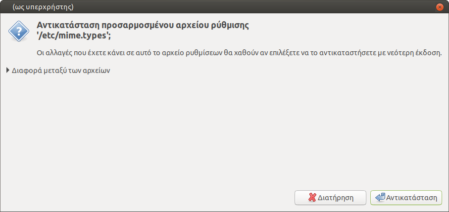](upgrade-09-mime.png)Εάν εμφανιστεί ερώτηση
**`Αντικατάσταση προσαρμοσμένου αρχείου ρύθμισης '/etc/mime.types';`**,
επιλέξτε **`Αντικατάσταση`**.

## Ρύθμιση του openssh-server

[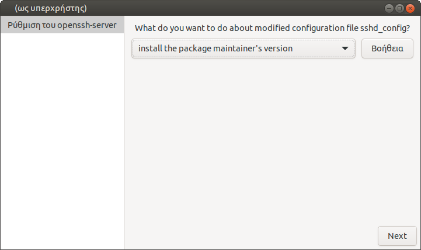](upgrade-10-sshd.png)Κάποια αρχεία όπως το
`/etc/ssh/sshd_config` είναι αλλαγμένα σε σχέση με την αρχική τους έκδοση (το
συγκεκριμένο από τα sch-scripts). Στην ερώτηση **`What do you want to do about
modified configuration file sshd_config?`**, επιλέξτε **`install the package
maintainer's version`** και πατήστε **`Next`**.

## Αφαίρεση παρωχημένων πακέτων

[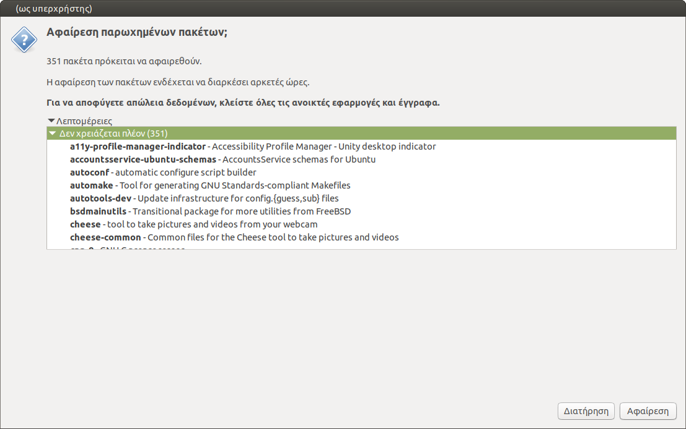](upgrade-11-remove.png)Κάποια πακέτα δεν χρειάζονται
πια στη νέα έκδοση του Ubuntu. Πατήστε **`Αφαίρεση`** για να καταργηθούν.

## Επανεκκίνηση

[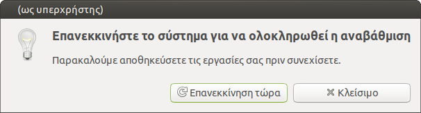](upgrade-12-restart.png)Πατήστε **`Επανεκκίνηση
τώρα`** για να ολοκληρωθεί η αναβάθμιση.

## Επανεγκατάσταση προγραμμάτων

Όπως προαναφέρθηκε, οι πηγές τρίτων απενεργοποιήθηκαν κατά την αναβάθμιση και
έτσι τα πακέτα που δεν προέρχονται από το Ubuntu, όπως sch-scripts,
google-chrome, skype κλπ, δεν θα λαμβάνουν πια αναβαθμίσεις. Ξαναεγκαταστήστε
τα εξ' αρχής ώστε να ρυθμιστούν κατάλληλα και οι πηγές λογισμικού. Συγκεκριμένα
για τα sch-scripts, ακολουθήστε τις ενότητες
[Εγκατάσταση](../../ltsp/installation.md) και [Δημοσίευση εικονικού
δίσκου](../../ltsp/ltsp-commands.md/#ltsp-image).

## Ενημέρωση θέματος

[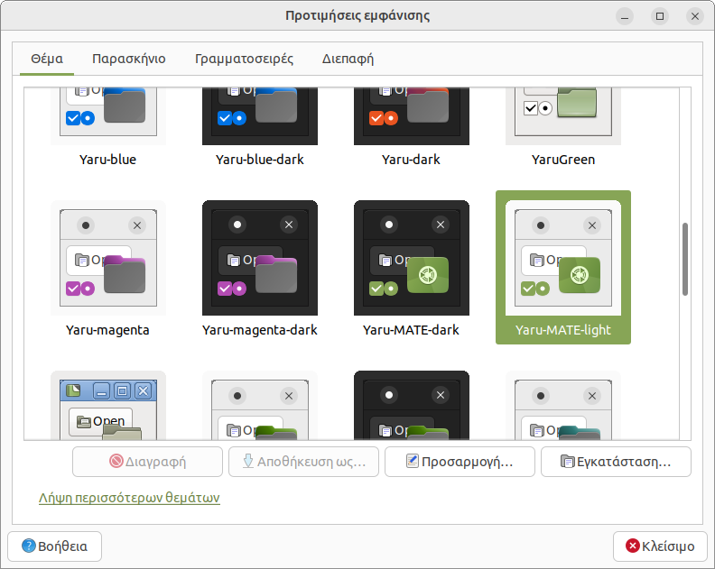](upgrade-13-theme.png)Στην επιφάνεια εργασίας κάντε
**`Δεξί κλικ`** → **`Αλλαγή παρασκηνίου επιφάνειας εργασίας`** → **`Θέμα`** →
**`Yaru MATE light`** → **`Κλείσιμο`**. Αυτό θα αλλάξει τις ρυθμίσεις των
παραθύρων ώστε να ταιριάζουν με τη νέα έκδοση. Πιθανώς να χρειαστεί να κάνουν
το ίδιο και οι μαθητές.

## Ενημέρωση του μενού iPXE

Από τη [Διαχείριση ΣΕΠΕΗΥ](../../glossary/index.md#sch-scripts) επιλέξτε το
μενού ***Εξυπηρετητής*** ▸ ***Αρχεία ρυθμίσεων*** ▸ ***ltsp.conf***. Κάντε
αναζήτηση για `22.04` και αντικαταστήστε το με `24.04` ώστε να προκύψει η
παρακάτω γραμμή:

```text title="/etc/ltsp/ltsp.conf"
IPXE_X86_64_IMG="Ubuntu 24.04 MATE (64 bit)"
```

Στη συνέχεια επιλέξτε το μενού ***Εξυπηρετητής*** ▸ ***Εντολές LTSP*** ▸
***ltsp ipxe*** ώστε να ενημερωθεί κατάλληλα το μπλε μενού του iPXE που
εμφανίζεται κατά την εκκίνηση των clients.

## Καθαρισμός ρυθμίσεων

Τέλος, εάν θέλετε να επαναρχικοποιήσετε τα δεδομένα ή τις ρυθμίσεις των
μαθητικών λογαριασμών, διαβάστε τη σελίδα [Εκτέλεση
εντολών](../../ltsp/run-commands.md).
