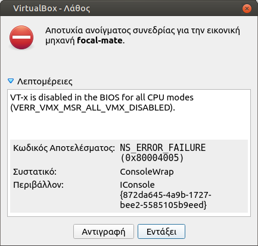

# Εικονικές μηχανές (Virtual Machines)

Η Τ.Σ. του Π.Σ.Δ. έχει δημιουργήσει και συντηρεί έτοιμες εικονικές
μηχανές:

1.  [Ubuntu Bionic MATE 18.04 **32bit**](https://ts.sch.gr/repo/images/VMs/bionic-mate.squashfs)

2.  [Ubuntu Focal MATE 20.04 **64bit**](https://ts.sch.gr/repo/images/VMs/focal-mate.squashfs)

τις οποίες μπορείτε να χρησιμοποιείτε με διάφορους τρόπους, όπως:

-   Αν έχετε μικτό εργαστήριο 32/64bit clients, ως **εικονικό** 32bit Λ.Σ.
    (***VirtualBox***) μέσα σε **πραγματικό/φυσικό** 64bit LTSP server, χωρίς
    έτσι να χρειάζεται η αγορά/ύπαρξη δεύτερου πραγματικού LTSP server.

-   Ως το κύριο Λ.Σ., μετατρέποντας τον εικονικό σκληρό δίσκο `.vmdk`, σε
    πραγματικό partition του σκληρού σας δίσκου (**Κλωνοποίηση**).

-   Ως εικονικό Λ.Σ. δοκιμών (Ubuntu MATE), μέσα στο πραγματικό Λ.Σ. που ήδη έχετε.

## 32bit clients σε LTSP server 64bit {:#32bit-clients-ltsp-64bit}

### Σενάριο

Έχετε ήδη εγκαταστημένο LTSP server **64bit** και θέλετε να υποστηρίξετε **και
32bit clients**. Λόγω αρχιτεκτονικής **τα 32bit clients δεν μπορούν να
εξυπηρετηθούν από τον 64bit εικονικό δίσκο**, που ήδη χρησιμοποιείτε για τα
64bit clients του εργαστηρίου σας. Η λύση σε αυτό είναι η χρήση εικονικής
μηχανής 32bit (`VirtualBox`).

Ουσιαστικά **θα συντηρείτε δύο Ubuntu MATE**. To 64bit του LTSP server σας και
το 32bit της εικονικής μηχανής. Για τα 64bit clients δεν αλλάζει κάτι, θα
συνεχίσουν να εξυπηρετούνται από τον εικονικό δίσκο του LTSP server. Τα 32bit
clients όμως θα εξυπηρετούνται από 32bit εικονικό δίσκο `.img` τον οποίο θα
δημιουργείτε απο τον τοπικό δίσκο της εικονικής μηχανής `.vmdk`.

### Προϋποθέσεις

-   Λειτουργικό εργαστήριο με LTSP server με **64bit clients**.
-   **32bit client(s)** με τις προτεινόμενες
    [προδιαγραφές](../../ltsp/requirements.md).

### Βήματα υλοποίησης

1.  Ακολουθείτε χωρίς αλλαγές τον οδηγό [Λ.Σ. δοκιμών (Ubuntu
    MATE)](#os-testing), ώστε να έχετε στον **64bit** LTSP server σας, μια
    Bionic MATE **32bit** εικονική μηχανή.

    !!! info "Πληροφορία"

        -   Η εικονική μηχανή **δε συμμετέχει στο τοπικό δίκτυο** του εργαστηρίου
            γι' αυτο και **δε χρειάζεται αλλαγές στις ρυθμίσεις δικτύου της**. Έχει
            πρόσβαση στο διαδίκτυο, αλλά βρίσκεται σε άλλο υποδίκτυο (NAT).

        -   Αν και στην εικονική μηχανή θα βρείτε προεγκατεστημένο το ***Επόπτης*** και
            τη ***Διαχείριση ΣΕΠΕΗΥ*** τα αγνοείτε. **Η διαχείριση του εργαστηρίου και
            των χρηστών γίνεται μόνο απο τον 64bit LTSP server**.

        -   Μετά το 1ο βήμα, μπορείτε να σβήσετε τη συμπιεσμένη εικονική μηχανή
            `.squashfs`, ώστε να εξοικονομήσετε χώρο στο δίσκο του LTSP server.

2.  Με **κλειστή** την εικονική μηχανή, από [τερματικό](../../glossary#terminal):

    ```shell
    # Κατάλληλη "σύνδεση" του x86_32.img, ώστε να δημιουργείται από το bionic-mate-flat.vmdk
    sudo ln -s $HOME/VirtualBox\ VMs/bionic-mate/bionic-mate-flat.vmdk /srv/ltsp/x86_32.img
    # Δημοσίευση εικονικού δίσκου x86_32.img
    sudo ltsp image x86_32
    # Ενημέρωση των καταχωρήσεων στο μενού του ipxe.
    sudo ltsp ipxe
    ```

    Για να επιβεβαιώσετε ότι πλέον έχετε δύο εικονικούς δίσκους (x86_32/x86_64):

    ```shell-session
    $ sudo ls -lR /srv/ltsp
    /srv/ltsp:
    σύνολο 8
    drwx------ 2 root root 4096 Απρ   2 12:28 images
    lrwxrwxrwx 1 root root   73 Απρ   2 12:23 x86_32.img -> '../../home/administrator/VirtualBox VMs/bionic-mate/bionic-mate-flat.vmdk'

    /srv/ltsp/images:
    σύνολο 4336212
    -rw-r--r-- 1 root root 2395348992 Απρ   2 12:28 x86_32.img
    -rw-r--r-- 1 root root 2044923904 Μαρ  16 18:21 x86_64.img
    ```

Αν όλα έχουν πάει σωστά, ανάλογα ποιας αρχιτεκτονικής client θα εκκινείτε, θα
επιλέγεται αυτόματα ο κατάλληλος εικονικός δίσκος.

!!! warning "Προσοχή"

    1.  Την εικονική μηχανή **να την ανοίγετε μόνο** όταν θέλετε να εγκαταστήσετε
        καποιο λογισμικό ή να κάνετε ενημερώσεις. Έτσι δεν επιβαρύνεται και η
        CPU/RAM του LTSP server.

    2.  Να φροντίζετε ώστε η εικονική μηχανή να έχει εγκατεστημένα τα ίδια
        λογισμικά με τον LTSP server, έτσι ώστε οι χρήστες, ανεξάρτητα ποιας
        αρχιτεκτονικής clients (32/64bit) θα χρησιμοποιούν, να έχουν διαθέσιμα τα
        ίδια προγράμματα/μενού.

    3.  Μετά από κάθε εργασία εγκατάστασης/ενημέρωσης της εικονικής μηχανής,
        **να την κλείνετε** και να κάνετε δημοσίευση του 32bit εικονικού δίσκου της:
        `sudo ltsp image x86_32`.

## Κλωνοποίηση μέσω LTSP server {:#clone-via-ltsp}

### Σενάριο

Έχετε ήδη εγκαταστημένο LTSP server και θέλετε να εγκαταστήσετε Ubuntu MATE σε
υπολογιστή μέσω του τοπικού δικτύου, έτσι ώστε στη συνέχεια, να τον
χρησιμοποιήσετε ως standalone θέση εργασίας ή να τον μετατρέψετε σε LTSP
server.

### Προϋποθέσεις

-   Λειτουργικός LTSP server.
-   Τοπικό δίκτυο. Προτείνεται στα 1000 Mbps έτσι ώστε να γίνει πολύ γρήγορα η
    εγγραφή του εικονικού.
-   Υπολογιστής "στόχος" με τις προτεινόμενες
    [προδιαγραφές](../../ltsp/requirements.md).
-   Κατάλληλες ρυθμίσεις στο BIOS "στόχου", ώστε να είναι σε BIOS mode (ή
    UEFI/legacy mode), γιατί και ο εικονικός `.vmdk` είναι σε BIOS/MBR mode.
-   Συμπιεσμένη εικονική μηχανή `.squashfs` μέσα στο φάκελο `VirtualBox VMs`.

    !!! warning "Προσοχή"
        **Μόνο την "κατεβάζετε", δεν αποσυμπιέζετε** το `.squashfs`, γιατί
        μπορεί να σας κάνει overwrite προϋπάρχουσα εικονική μηχανή. Η λήψη
        μπορεί να γίνει και όπως περιγράφετε στο 1ο βήμα της ενότητας [Λ.Σ.
        δοκιμών (Ubuntu MATE)](#os-testing).

### Βήματα υλοποίησης

1.  [Εκκίνηση από το δίκτυο](../../ltsp/netboot.md) του υπολογιστή "στόχου".

2.  Σύνδεση ως `administrator` στον υπολογιστή "στόχο".

3.  Από [τερματικό](../../glossary#terminal) π.χ. ως `administrator@ltsp147`:

    !!! warning "Προσοχή"
        Η εντολή `dd` διαγράφει **όλα** τα δεδομένα του δίσκου **οριστικά**!!!

    ```shell
    # Απενεργοποίηση τυχόν τοπικών swap files.
    sudo swapoff -a
    # Εύρεση του "ονόματος" του τοπικού δίσκου (π.χ. sda).
    lsblk --fs
    # Προσάρτηση του .squashfs π.χ. για το focal-mate:
    udisksctl loop-setup -f ~/"VirtualBox VMs"/focal-mate.squashfs
    # Εγγραφή του .vmdk, στον τοπικό δίσκο π.χ. για sda:
    sudo dd if=/media/$USER/disk/focal-mate-flat.vmdk of=/dev/sda bs=1M status=progress
    # Αποπροσάρτηση του .squashfs
    umount /media/$USER/disk
    ```

4.  **Χωρίς** να κάνετε **επανεκκίνηση** τον υπολογιστή "στόχο" συνεχίζεται στο
    τερματικό π.χ. για `/dev/sda`:

    ```shell
    gparted /dev/sda
    ```

    Στο [GParted](../gparted/index.md) πρέπει να γίνουν δύο βασικές ενέργειες:

    1.  **Αύξηση** του μεγέθους του swap partition ***/dev/sda2*** σε 4100 MB
        και **μετακίνηση** του στο τέλος του δίσκου. **Πριν** το επόμενο βήμα
        να γίνει ***Εφαρμογή όλων των εργασιών*** (εικονίδιο
        ).

    2.  **Αύξηση** του μεγέθους του linux partition ***/dev/sda1*** ώστε να
        καταλαμβάνει όλο το διαθέσιμο δίσκο και ***Εφαρμογή όλων των
        εργασιών*** (εικονίδιο
        ).

Ο υπολογιστής "στόχος" είναι έτοιμος. Μπορείτε να κάνετε επανεκκίνηση ώστε να
ελέγξετε ότι είναι λειτουργικός.

## Κλωνοποίηση μέσω Live USB {:#clone-via-liveusb}

### Σενάριο

Θέλετε να εγκαταστήσετε Ubuntu MATE σε υπολογιστή μέσω τοπικού μέσου (π.χ. Live
USB), έτσι ώστε στη συνέχεια, να τον χρησιμοποιήσετε ως standalone θέση εργασίας
ή να τον μετατρέψετε σε LTSP server.

### Προϋποθέσεις

-   [Live USB](../../ubuntu/liveusb.md).
-   [Συμπιεσμένη εικονική μηχανή](index.md) `.squashfs`, στον αρχικό κατάλογο
    `/` του Live USB.
-   Υπολογιστής "στόχος" με τις προτεινόμενες
    [προδιαγραφές](../../ltsp/requirements.md).
-   Κατάλληλες ρυθμίσεις στο BIOS "στόχου", ώστε να είναι σε BIOS mode (ή
    UEFI/legacy mode), γιατί και ο εικονικός `.vmdk` είναι σε BIOS/MBR mode.

### Βήματα υλοποίησης

1.  Εκκίνηση του υπολογιστή "στόχου" με τη χρήση του Live USB.

    !!! tip ""
        Για την εκκίνηση από Live USB ισχύει ότι και στην
        [Εγκατάσταση](../../ubuntu/installation.md) του Ubuntu.

2.  Από [τερματικό](../../glossary#terminal):

    !!! warning "Προσοχή"
        Η εντολή `dd` διαγράφει **όλα** τα δεδομένα του δίσκου **οριστικά**!!!

    ```shell
    sudo -i
    # Απενεργοποίηση τυχόν τοπικών swap files.
    swapoff -a
    # Εύρεση του "ονόματος" του τοπικού δίσκου (π.χ. sda).
    lsblk --fs
    # Προσάρτηση του .squashfs π.χ. για το focal-mate:
    udisksctl loop-setup -f /isodevice/focal-mate.squashfs
    # Αν το mapped έγινε στο /dev/loop6, τότε:
    udisksctl mount -b /dev/loop6
    # Εγγραφή του .vmdk, στον τοπικό δίσκο π.χ. για sda:
    dd if=/media/$USER/disk/focal-mate-flat.vmdk of=/dev/sda bs=1M status=progress
    # Αποπροσάρτηση του .squashfs
    umount /media/$USER/disk
    exit
    ```

3.  Ίδιες ενέργειες με το **βήμα 4** του οδηγού [Κλωνοποίηση μέσω LTSP
    server](#clone-via-ltsp).

Ο υπολογιστής "στόχος" είναι έτοιμος. Μπορείτε να κάνετε επανεκκίνηση ώστε να
ελέγξετε ότι είναι λειτουργικός.

## Λ.Σ. δοκιμών (Ubuntu MATE) {:#os-testing}

Για να κάνετε χρήση της έτοιμης εικονικής μηχανής π.χ. της Ubuntu Bionic MATE
20.04 **32bit**, θα πρέπει να ακολουθήσετε τα επόμενα βήματα:

1.  Από [τερματικό](../../glossary#terminal):

    ```shell
    mkdir -p ~/"VirtualBox VMs"
    cd ~/"VirtualBox VMs"
    # Download της συμπιεσμένης εικονικής μηχανής.
    wget https://ts.sch.gr/repo/images/VMs/bionic-mate.squashfs
    # Αποσυμπίεση στο φάκελο VirtualBox VMs/bionic-mate.
    unsquashfs -f -d bionic-mate bionic-mate.squashfs
    ```

    !!! tip ""
        Αν χρειαστείτε την `focal-mate`, στις εντολές όπου `bionic-mate`
        αντικαταστήστε με `focal-mate`.

2.  [Εγκατάσταση](../../ubuntu/software.md) του ***VirtualBox***. Μόλις
    ολοκληρωθεί η εγκατάσταση, θα το βρείτε στο ***Εφαρμογές*** ▸ ***Εργαλεία
    συστήματος*** ▸ ***VirtualBox***.

3.  Εισαγωγή της εικονικής μηχανής `bionic-mate.vbox` στο VirtualBox από το
    μενού: ***Μηχανή*** ▸ ***Προσθήκη...*** ή με **`Ctrl`**+**`A`**.

    !!! tip ""
        Το αρχείο `.vbox` βρίσκεται μέσα στον αντίστοιχο φάκελο του `VirtualBox
        VMs`.

4.  Πριν επιλέξετε ***Εκκίνηση*** θα πρέπει να ελέγξετε τις ***Ρυθμίσεις*** της
    εικονικής μηχανής. Το κυριότερο είναι το μέγεθος της μνήμης **RAM** να
    είναι στα **προτεινόμενα όρια**.

    [](VT-x_BIOS.png)
    !!! tip "Χρήσιμο"
        Σε περίπτωση που κατά την ***Εκκίνηση*** εμφανιστεί το μήνυμα της
        διπλανής εικόνας, θα πρέπει από το BIOS/UEFI να ενεργοποιήσετε την
        επιλογή ***Intel Virtualization Technology (VT-x)***. Το αντίστοιχο
        μήνυμα για AMD CPU θα είναι: `AMD-V is disabled in the BIOS`.

!!! info clear "Πληροφορία"
    Ο οδηγός των διαφόρων μεθόδων κλωνοποίησης θα ενημερώνεται συνεχώς. Για περισσοτερες πληροφορίες/λύσεις/απορίες δείτε:

    -   [Κλωνοποίηση εγκαταστάσεων Linux/Windows](https://alkisg.mysch.gr/steki/index.php?topic=7658.0)
    -   [Κλωνοποίηση δίσκου UEFI](https://alkisg.mysch.gr/steki/index.php?topic=8762.0)
    -   [Απομακρυσμένη κλωνοποίηση δίσκου από ΠΛΗΝΕΤ σε
        σχολείο](https://alkisg.mysch.gr/steki/index.php?topic=8602.0)
