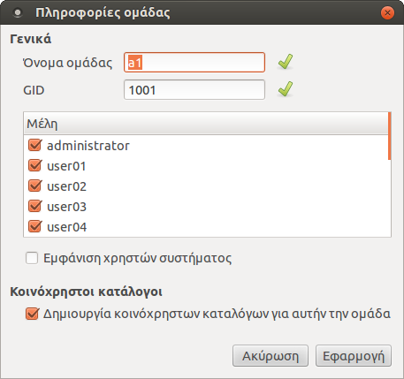

# Τμήματα

Η εφαρμογή ***Διαχείριση ΣΕΠΕΗΥ**, δίνει επίσης την δυνατότητα δημιουργίας
ομάδων (τμήματα) για την ομαδοποίηση των χρηστών και την ανταλλαγή αρχείων
μεταξύ χρηστών της ίδιας ομάδας μέσω των κοινόχρηστων καταλόγων.

!!! tip "Συμβουλή"
    Οι κοινόχρηστοι φάκελοι ενεργοποιούνται αυτόματα όταν χρησιμοποιείτε τους
    διαλόγους μαζικής [δημιουργίας χρηστών](users.md). Η παρούσα σελίδα
    χρειάζεται μόνο για την περίπτωση [Ξεχωριστός λογαριασμός ανά
    χρήστη](users.md/#ξεχωριστός-λογαριασμός-ανά-χρήστη).

## Δημιουργία ομάδας

Για να δημιουργήσετε μια ομάδα:

 1. Κάντε κλικ στο μενού ***Ομάδες*** ▸ ***Νέα ομάδα***. Θα εμφανιστεί ο
    διάλογος που φαίνεται δεξιά.
 2. Δώστε το επιθυμητό όνομα στο πεδίο ***Όνομα ομάδας***.
 3. Επιλέξτε τους χρήστες που επιθυμείτε να εντάξετε στην ομάδα.
 4. Επιλέξτε ***Δημιουργία κοινόχρηστων καταλόγων για αυτήν την ομάδα*** εάν
    επιθυμείτε την δημιουργία [κοινόχρηστων καταλόγων](shared-folders.md) για
    αυτήν την ομάδα.
 5. Τέλος, πατήστε ***Εφαρμογή***.

!!! note "Σημείωση"
    - Στο πεδίο ***Όνομα ομάδας*** μπορείτε να δώσετε μόνο λατινικούς
    χαρακτήρες.

Αρχικά, στη λίστα που βρίσκεται κάτω από τα πεδία ***Όνομα ομάδας*** και
***GID*** εμφανίζονται όλοι οι χρήστες τους συστήματος. Ενεργοποιώντας την
επιλογή ***Εμφάνιση χρηστών συστήματος***, στη λίστα αυτή θα εμφανιστούν επίσης
και "build-in" χρήστες όπως root, noboby, κ.τ.λ.

## Επεξεργασία ομάδας

Για να επεξεργαστείτε μια ομάδα, μπορείτε
να χρησιμοποιήσετε την επιλογή ***Ομάδες*** ▸ ***Επεξεργασία ομάδας*** αφού
πρώτα έχετε επιλέξει την επιθυμητή ομάδα από την λίστα που βρίσκεται στα
αριστερά της αρχικής οθόνης της εφαρμογής.

Στο συγκεκριμένο διάλογο μπορείτε:

  - Να δείτε το όνομα της ομάδας, το GID, τους χρήστες που ανήκουν σε αυτήν
    καθώς και εάν υπάρχουν κοινόχρηστοι κατάλογοι για αυτήν την ομάδα.
  - Να αλλάξετε το όνομα της ομάδας από το πεδίο ***Όνομα ομάδας***.
  - Να αλλάξετε το GID της ομάδας από το πεδίο ***GID***.
  - Να εισάγετε/αφαιρέσετε χρήστες.
  - Να δημιουργήσετε ή να καταργήσετε τους κοινόχρηστους καταλόγους για
    την ομάδα που έχετε επιλέξει να επεξεργαστείτε.

## Διαγραφή ομάδας

Για να διαγράψετε μια ομάδα:

1.  Επιλέξτε την ομάδα που επιθυμείτε από την λίστα που βρίσκεται στα
    αριστερά της αρχικής οθόνης της εφαρμογής.
2.  Κάντε κλικ στο μενού ***Ομάδες*** ▸ ***Διαγραφή ομάδας***.
3.  Τέλος, στον διάλογο επιβεβαίωσης πατήστε .
