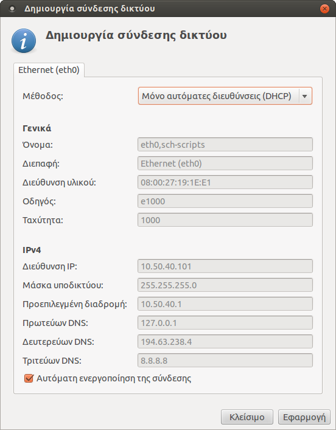

# Ρύθμιση σύνδεσης δικτύου

!!! tip "Συμβουλή"
    Το βήμα αυτό χρειάζεται μια φορά στην αρχική εγκατάσταση, αλλά και κάθε
    φορά που ο server αλλάζει υποδίκτυο (π.χ. router ή σχολείο)

Φροντίστε ώστε ο εξυπηρετητής να
είναι συνδεδεμένος στο τοπικό δίκτυο. Ανοίξτε την εφαρμογή [Διαχείριση
ΣΕΠΕΗΥ](index.md) και επιλέξτε το μενού ***Εξυπηρετητής*** ▸ ***Ρύθμιση
σύνδεσης δικτύου***. Θα εμφανιστεί ο διάλογος που φαίνεται δεξιά. Στη συνέχεια
πατήστε απλά το κουμπί ***Εφαρμογή***. Το υπόλοιπο της σελίδας είναι απλά
ενημερωτικό, εάν βιάζεστε μπορείτε να το προσπεράσετε.

---

Ο διάλογος αυτός επιλέγει αυτόματα τις κατάλληλες ρυθμίσεις ανάλογα με τον τύπο
του router του σχολείου σας. Δεν προτείνεται να επιλέξετε κάτι διαφορετικό,
εκτός εάν είστε σίγουροι ότι η αυτόματη επιλογή δεν ήταν σωστή. Στη συνέχεια
περιγράφονται οι διάφορες επιλογές που δίνει αυτός ο διάλογος.

## Αυτόματα (DHCP)

Αυτή η επιλογή λέει στον εξυπηρετητή να δεχτεί και την IP και τους DNS servers
που του δίνει ο router. Δεν προτείνεται σε καμία περίπτωση, η επόμενη επιλογή
είναι πάντα καλύτερη.

## Μόνο αυτόματες διευθύνσεις (DHCP)

Ο εξυπηρετητής θα δεχτεί την IP που του δίνει ο router, αλλά για DNS servers θα
χρησιμοποιήσει με τη σειρά πρώτα τον τοπικό dnsmasq για πολύ μεγαλύτερη
ταχύτητα, μετά τον DNS server του ΠΣΔ και τέλος, εάν αυτός πέσει, τον DNS
server της Google. Η επιλογή "Μόνο αυτόματες διευθύνσεις (DHCP)" είναι η πιο
ασφαλής από όλες, εάν έχετε αμφιβολίες μπορείτε να διαλέγετε αυτήν. Όμως και
πάλι κάθε φορά που ο εξυπηρετητής πηγαίνει σε άλλο τοπικό δίκτυο θα πρέπει να
γίνεται αυτό το βήμα.

## Χειροκίνητα

Αυτή η επιλογή προτείνεται αυτόματα όταν ανιχνεύεται ένα "τυπικό ΣΕΠΕΗΥ". Στα
τυπικά ΣΕΠΕΗΥ που τηρούν τις προδιαγραφές, υπάρχει cisco ή mikrotik router, και
θεωρητικά και Windows Server με IP=10.x.y.10, ο οποίος εκτελεί και χρέη DNS
server. Όμως στην πράξη οι περισσότεροι Windows Servers έχουν φορμαριστεί και
δεν εκτελούν πια την υπηρεσία DNS server.

Επομένως, εάν έχετε Windows Server με DNS server και IP=10.x.y.10, τότε τον
Ubuntu Server να τον βάλετε στην IP=10.x.y.11, αλλιώς να τον βάλετε στην
προεπιλεγμένη IP=10.x.y.10.

## LTSP

!!! tip "Συμβουλή"
    Ο βασικός λόγος να επιλέξετε αυτήν την σύνδεση είναι αν έχει χαλάσει ο
    router του σχολείου, οπότε τότε δεν θα παίρνουν IP οι clients και δεν θα
    ξεκινάνε από το δίκτυο. Με την "σύνδεση LTSP", ο εξυπηρετητής θα
    λειτουργήσει ως DHCP server και οι clients θα μπουτάρουν. Θυμηθείτε όμως
    όταν λυθεί το πρόβλημα με τον router, να επιλέξετε μία από τις άλλες
    συνδέσεις.
    TODO: να επιτρέπεται η σύνδεση LTSP και με μία κάρτα δικτύου.

Ένας δεύτερος λόγος είναι εάν έχετε δύο κάρτες δικτύου στον server και θέλετε
να απομονώσετε τους LTSP clients σε ξεχωριστό switch. Τότε αφήνετε τις
προεπιλεγμένες ρυθμίσεις του Ubuntu για την πρώτη κάρτα που βλέπει το Internet,
και ρυθμίζετε την δεύτερη που βλέπει τους clients ως "σύνδεση LTSP". Η μέθοδος
αυτή δεν προτείνεται λόγω πολυπλοκότητας στην καλωδίωση.

## Να μη δημιουργηθεί σύνδεση

Να παραμείνει η υπάρχουσα σύνδεση όπως έχει χωρίς αλλαγές.
