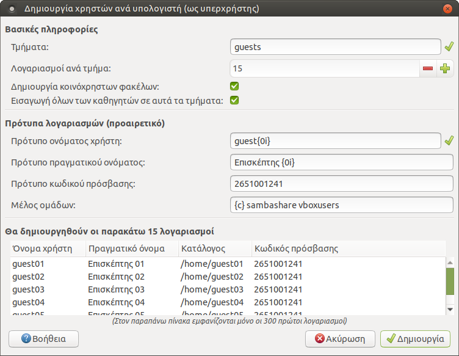
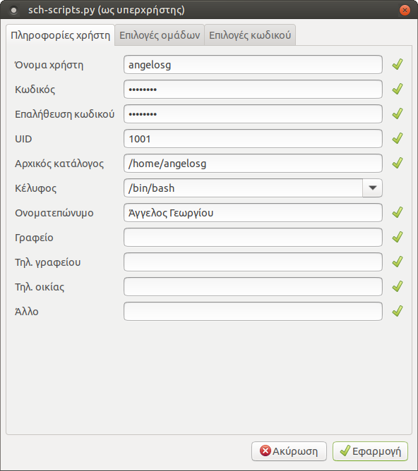

# Λογαριασμοί χρηστών

Στο LTSP, η διαχείριση των user accounts γίνεται κεντρικά στον server. Η
εφαρμογή ***Διαχείριση ΣΕΠΕΗΥ*** υποστηρίζει τρία μοντέλα για λογαριασμoύς
χρηστών τα οποία περιγράφονται παρακάτω. Προτείνεται να εφαρμόσετε όλοι το
πρώτο, και προαιρετικά να ακολουθήσετε επιπλέον και είτε το δεύτερο είτε το
τρίτο.

!!! warning "Προειδοποίηση"
    Αφού τελειώσετε αυτό το βήμα, θα χρειαστεί να εκτελέσετε την εντολή
    [ltsp initrd](ltsp-commands.md#ltsp-initrd) και να επανεκκινήσετε τους
    clients.

## Ένας λογαριασμός ανά υπολογιστή

Είναι επιθυμητό να δημιουργηθούν λογαριασμοί χρηστών για κάθε υπολογιστή του
εργαστηρίου, οι οποίοι θα μπορούν να χρησιμοποιηθούν:

  - ως κανονικοί λογαριασμοί `student00` για σύνδεση με autologin, εάν δεν
    πρόκειται να φτιάξετε άλλους λογαριασμούς,
  - ή ως λογαριασμοί `guest00` για σύνδεση χωρίς κωδικό πρόσβασης, για
    παράδειγμα από μαθητές στην αρχή της χρονιάς ή από καθηγητές-επισκέπτες.

    !!! note "Σημείωση"
        Τα αρχεία των λογαριασμών `guest00` δεν διαγράφονται κατά την
        αποσύνδεση.

[](users-per-pc.png)Από τη ***Διαχείριση ΣΕΠΕΗΥ***,
πηγαίνετε στο μενού ***Αρχείο*** ▸ ***Δημιουργία χρηστών ανά υπολογιστή*** και
συμπληρώστε τον διάλογο που θα εμφανιστεί με τα στοιχεία που φαίνονται στην
εικόνα δεξιά. Το κουμπί ***Βοήθεια*** εξηγεί τι σημαίνουν τα `{0i}` κλπ.
TODO: θέλει βελτίωση το κείμενο του διαλόγου Βοήθεια.

  - Αν δεν πρόκειται να δημιουργήσετε άλλους λογαριασμούς, όπου βλέπετε `guest`
    βάλτε `student`, και όπου βλέπετε `Επισκέπτης` βάλτε `Μαθητής` ή `Χρήστης`.
  - Στο ***Λογαριασμοί ανά τμήμα*** βάλτε λίγο παραπάνω από τον αριθμό Η/Υ που
    έχει το εργαστήριο, μήπως κάποτε χρειαστεί να ξεκινήσετε κάποιο laptop ή
    άλλον Η/Υ.
  - Στο ***Πρότυπο κωδικού πρόσβασης*** μπορείτε να βάλετε π.χ. το τηλέφωνο του
    σχολείου. Δεν θα χρειαστεί ποτέ να το μάθουν ή να το πληκτρολογήσουν οι
    guests/students.

## Ένας λογαριασμός ανά υπολογιστή και ανά τμήμα

[](users-per-class.png)Δείτε λίγο την εικόνα στα δεξιά.
Ανοίγοντας πάλι τον προηγούμενο διάλογο, μπορούμε να φτιάξουμε λογαριασμούς ανά
υπολογιστή και ανά τμήμα. Έτσι για παράδειγμα ο μαθητής του τμήματος a1 που
κάθεται στον υπολογιστή pc01 θα συνδέεται με όνομα χρήστη `a1-01` και με τον
κωδικό που θα ορίσετε (π.χ. πάλι a1-01). Θα έχει ξεχωριστά έγγραφα, ρυθμίσεις,
ταπετσαρία κλπ από όλους τους υπόλοιπους μαθητές, αποφεύγοντας διενέξεις και
προστατεύοντας καλύτερα τα δεδομένα του.

   - Στο ***Τμήματα*** μπορείτε να βάλετε και π.χ. `a1a a1b ...`, εάν το
     τμήμα a1 "σπάει" στα δύο όταν μπαίνει στο εργαστήριο.

!!! tip "Συμβουλή"
    Στο κάτω μέρος του διαλόγου υπάρχει προεπισκόπηση των στοιχείων των
    λογαριασμών, βεβαιωθείτε ότι είναι όπως επιθυμείτε.

## Ξεχωριστός λογαριασμός ανά χρήστη

Σε αυτό το μοντέλο κάθε χρήστης έχει δικό του λογαριασμό της μορφής
`epwvumo_ovoma` και τον διατηρεί για όλα τα χρόνια που είναι στο ίδιο σχολείο,
είτε είναι μαθητής είτε καθηγητής. Αν και επιφέρει λίγο φόρτο στον διαχειριστή,
ίσως να είναι ταιριαστή μέθοδος όταν οι μαθητές συμμετέχουν σε πολλά τμήματα
(γενικής παιδείας, ξένων γλωσσών, κατεύθυνσης, projects...). Η εφαρμογή
***Διαχείριση ΣΕΠΕΗΥ*** διαθέτει τέσσερις διαφορετικούς τρόπους δημιουργίας
χρηστών με ξεχωριστά ονόματα, οι οποίοι περιγράφονται παρακάτω.

### Δημιουργία νέου χρήστη {#create-new-user}

[](new-user.png)Από το μενού ***Χρήστες*** ▸ ***Νέος
χρήστης*** των sch-scripts εμφανίζεται ο διάλογος που φαίνεται δεξιά.
Συμπληρώστε τα στοιχεία ***Όνομα χρήστη***, ***Κωδικός***, ***Επαλήθευση
κωδικού*** και ***Ονοματεπώνυμο***, και από την καρτέλα ***Επιλογές ομάδων***
συμπληρώστε το πεδίο ***Ρόλος χρήστη*** και προαιρετικά τις ομάδες που είναι
μέλος.

!!! tip "Συμβουλή"
    Αυτή η μέθοδος είναι κατάλληλη και για λογαριασμούς καθηγητών.

### Χρήση αρχείου csv

Από το μενού ***Αρχείο*** ▸ ***Εξαγωγή σε csv*** μπορείτε να εξάγετε τα
στοιχεία των επιλεγμένων λογαριασμών χρηστών σε αρχείο csv. Αυτό χρησιμεύει
και ως αντίγραφο ασφαλείας, αλλά και ως υπόδειγμα που μπορείτε να ανοίξετε
στο LibreOffice Calc και να κάνετε μαζικά επικόλληση στοιχείων μαθητών π.χ.
από το MySchool. Δεν χρειάζεται να συμπληρωθούν όλες οι στήλες του .csv.

[](resolve-conflicts.png)

Στη συνέχεια μπορείτε από το μενού ***Αρχείο*** ▸ ***Εισαγωγή από csv*** να
εισάγετε το νέο αρχείο .csv. Εάν υπάρχουν συγκρούσεις, ο διάλογος που
εμφανίζεται δεξιά θα σας βοηθήσει να τα επιλύσετε, είτε πατώντας ***Αυτόματη
επίλυση προβλημάτων*** είτε διαγράφοντας τις προβληματικές καταχωρήσεις.

!!! warning "Προσοχή"
    Σε μερικές περιπτώσεις η επιλογή ***Αυτόματη επίλυση λογαριασμών*** δεν
    μπορεί να λύσει όλες τις συγκρούσεις. Σε αυτή την περίπτωση θα πρέπει να
    επέμβετε στα πεδία που παρουσιάζουν τις συγκρούσεις και να τροποποιήσετε τα
    περιεχόμενα τους σύμφωνα με την υπόδειξη που θα σας εμφανίζεται όταν
    τοποθετήσετε τον δείκτη του ποντικιού σας πάνω τους (tooltip).

### Χρήση αρχείου passwd

Εναλλακτικός τρόπος εισαγωγής χρηστών δίνεται από το μενού ***Αρχείο*** ▸
***Εισαγωγή από passwd***. Η συγκεκριμένη λειτουργία βοηθάει στη μεταφορά των
λογαριασμών από παλιότερη έκδοση του λειτουργικού Ubuntu. Το μόνο που
απαιτείται είναι να έχουν κρατηθεί σε κάποιον φάκελο τα αρχεία `/etc/passwd`,
`/etc/group` και `/etc/shadow` από το παλιό λειτουργικό.

Μετά την εισαγωγή του αρχείου `passwd`, ο διάλογος που εμφανίζεται είναι
παρόμοιος με αυτόν της επιλογής ***Εισαγωγή από csv***.

### Αιτήσεις εγγραφών νέων χρηστών

[](signup-server.png)Η ***Διαχείριση ΣΕΠΕΗΥ***
περιλαμβάνει μια υπηρεσία ανάλογη με τη διαδικασία εγγραφής π.χ. σε ένα φόρουμ,
όπου ο ίδιος ο μαθητής καταχωρεί τα στοιχεία του σε μία φόρμα, και ο υπεύθυνος
ΣΕΠΕΗΥ στη συνέχεια εγκρίνει τη δημιουργία του λογαριασμού.

Για να ενεργοποιήσετε αυτήν την υπηρεσία, πηγαίνετε στο μενού ***Αρχείο*** ▸
***Ενεργοποίηση εγγραφών χρηστών*** των sch-scripts. Θα ανοίξει η φόρμα που
φαίνεται δεξιά.

[](signup-review.png)Επιλέξτε τους ρόλους και τις ομάδες
χρηστών για τις οποίες επιτρέπονται οι εγγραφές στην παρούσα φάση, για
παράδειγμα, στις 1-10 Σεπτεμβρίου μπορείτε να επιτρέψετε μόνο εγγραφές
καθηγητών και προσωπικού, ενώ μετά τις 10 Σεπτεμβρίου μόνο μαθητών. Πατώντας το
κουμπί ***Συνέχεια***, θα εμφανιστεί η φόρμα παραλαβής των αιτημάτων των
χρηστών, όπως φαίνεται δεξιά.

!!! info "Πληροφορία"
    Οι αιτήσεις εγγραφής νέων χρηστών γίνονται αποδεκτές μόνο ενόσω αυτή η
    φόρμα είναι ανοιχτή.

[](signup-form.png) Στη συνέχεια, ανοίξτε τον Επόπτη,
επιλέξτε τους σταθμούς εργασίας στους οποίους θέλετε να εμφανίσετε τον διάλογο
εγγραφών, πατήστε το κουμπί ***Εκτέλεση*** της γραμμής εργαλείων, και δώστε την
εντολή:

```shell
sudo /usr/share/sch-scripts/signup
```

Πείτε στους χρήστες να συμπληρώσουν τα στοιχεία τους όπως φαίνεται δεξιά.
Τέλος, επεξεργαστείτε ή επικυρώστε τη δημιουργία λογαριασμών τους από τη φόρμα
παραλαβής αιτημάτων που έχετε ανοιχτή στον εξυπηρετητή.
