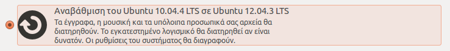

# Δίσκος με Linux

Στην περίπτωση
που έχετε ήδη εγκατεστημένη κάποια διανομή Linux, ο διάλογος που θα σας
εμφανιστεί σε αυτό το βήμα θα είναι παρόμοιος με αυτόν που φαίνεται στην εικόνα
δεξιά.

Ο διάλογος προτείνει τις εξής 4 περιπτώσεις:

- [Διατήρηση του περιβάλλοντος Linux](#διατήρηση-του-περιβάλλοντος-linux).
- [Αναβάθμιση του περιβάλλοντος Linux](#αναβάθμιση-του-περιβάλλοντος-linux).
- [Διαγραφή του περιβάλλοντος Linux](#διαγραφή-του-περιβάλλοντος-linux).
- [Χειροκίνητη δημιουργία κατατμήσεων](#χειροκίνητη-δημιουργία-κατατμήσεων).

## Διατήρηση του περιβάλλοντος Linux

Εάν θέλετε να εγκαταστήσετε το Ubuntu παράλληλα με το περιβάλλον Linux που
έχετε:

1. Επιλέξτε την πρώτη
   επιλογή και έπειτα ***Συνέχεια***. Με αυτήν την επιλογή θα πραγματοποιηθεί
   σμίκρυνση στην κατάτμηση του λειτουργικού συστήματος Linux ώστε να προκύψει
   ελεύθερος χώρος στον οποίο θα εγκατασταθεί το Ubuntu.
2. Στον επόμενο
   διάλογο θα σας ζητηθεί να ορίσετε το μέγεθος των κατατμήσεων και για τα δύο
   λειτουργικά συστήματα. Αυτό μπορείτε να το κάνετε πηγαίνοντας το κέρσορα στο
   κενό που βρίσκεται ανάμεσα στις δύο κατατμήσεις και σέρνοντας το διαχωριστή
   είτε δεξιά είτε αριστερά όπως φαίνεται στην εικόνα δεξιά σας και επιλέξτε
   ***Εγκατάσταση τώρα***.
3. Τέλος, επιλέξτε ***Συνέχεια*** στον διάλογο που θα σας εμφανιστεί
   και θα σας ενημερώνει για το κίνδυνο αλλαγής των κατατμήσεων.

## Αναβάθμιση του περιβάλλοντος Linux

Εάν έχετε εγκατεστημένη παλιότερη έκδοση του λειτουργικού Ubuntu (όπως είναι
στο παράδειγμα):

1. Επιλέξτε την
   δεύτερη επιλογή και έπειτα ***Συνέχεια***. Με αυτήν την επιλογή θα
   διατηρηθούν τα προσωπικά σας δεδομένα και εάν είναι δυνατόν και οι εφαρμογές
   που είχατε εγκαταστήσει.

## Διαγραφή του περιβάλλοντος Linux

Εάν επιθυμείτε να διαγράψετε το εγκατεστημένο λειτουργικό Linux και να
εγκαταστήσετε το Ubuntu:

1. Επιλέξτε την τρίτη
    επιλογή και έπειτα ***Συνέχεια***.
2. Στον
   επόμενο διάλογο αρκεί να επιλέξτε ***Εγκατάσταση τώρα*** για να ξεκινήσει η
   εγκατάσταση.

## Χειροκίνητη δημιουργία κατατμήσεων

Τέλος, **εφόσον έχετε γνώσεις Linux** και επιθυμείτε κάτι άλλο, όπως για
παράδειγμα να ορίσετε μεγαλύτερο μέγεθος swap ή να δημιουργήσετε διαφορετικές
κατατμήσεις για τους καταλόγους του Ubuntu:

1. Επιλέξτε την τρίτη επιλογή ***Κάτι άλλο*** για να πραγματοποιήσετε
   χειροκίνητη δημιουργία των κατατμήσεων όπως επιθυμείτε.
