# Εγκατάσταση

Θεωρείται ότι έχετε ήδη κάνει τα βήματα [λήψης του Ubuntu](download.md) και
δημιουργίας [CD ή live USB stick](liveusb.md). Τοποθετήστε το στον υπολογιστή
και ξεκινήστε από αυτό. Μπορεί να χρειαστεί να πατήσετε κάποιο πλήκτρο όπως
**`Del`**, **`F12`**, **`Enter`** κλπ για να εμφανιστεί ο boot manager του
BIOS/UEFI.

!!! tip "Συμβουλή"

    - Είναι πιθανό το USB stick να εμφανιστεί δύο φορές στον boot manager.
      Δείτε τον οδηγό [Εκκίνηση σε κατάσταση BIOS ή UEFI](../guides/bios-uefi-boot/index.md).

    - Εάν έχετε ήδη κάποιο λειτουργικό σύστημα όπως Microsoft Windows,
      είναι σημαντικό να εκκινήσετε στην ίδια κατάσταση με το υπάρχον λειτουργικό.
      Στην περίπτωση των UEFI Windows, ακολουθήστε τον οδηγό
      [Ubuntu με UEFI Windows](../guides/install-with-uefi-windows/index.md).

## Επιλογή γλώσσας [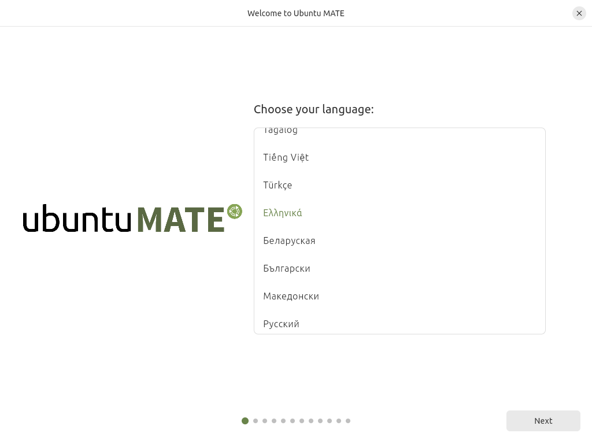](install-01-language.png)

Μετά την εκκίνηση του υπολογιστή από το live USB stick θα εμφανιστεί μία οθόνη
που θα ζητά να επιλέξετε γλώσσα.

- Επιλέξτε ***Ελληνικά***.
- Πατήστε ***Next***.

!!! warning clear "Προειδοποίηση"
    Επιλέξτε ***Ελληνικά*** ώστε το σύστημα να πάρει τις σωστές ρυθμίσεις
    γλώσσας, ακόμα κι αν προτιμάτε Αγγλικό περιβάλλον εργασίας. Μετά την
    εγκατάσταση μπορείτε να επιλέξετε τη γλώσσα από την οθόνη σύνδεσης των
    χρηστών.

## Προσβασιμότητα [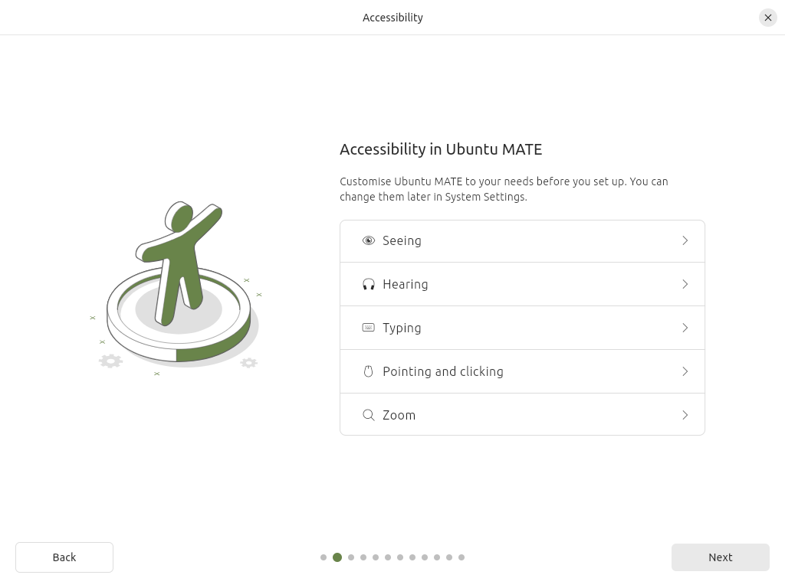](install-02-accessibility.png)

- Πατήστε ***Next***.

## Διάταξη πληκτρολογίου [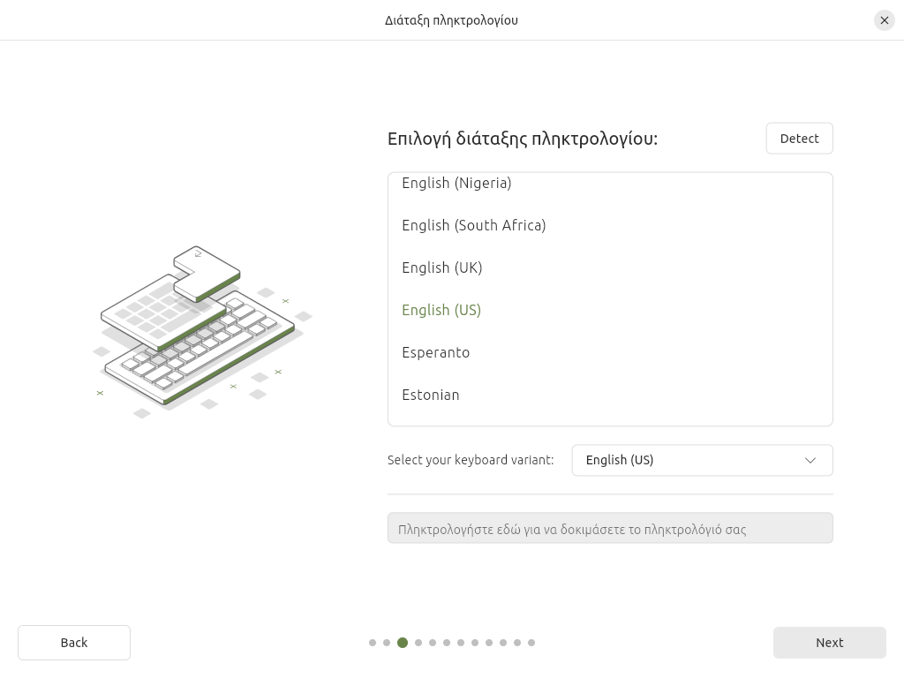](install-03-keyboard.png)

Το πρόγραμμα εγκατάστασης του Ubuntu έχει εδώ και πολλά χρόνια πρόβλημα με την
διάταξη πληκτρολογίου. Μην επιλέξετε ***Ελληνικά***, γιατί τότε δεν θα μπορείτε
να πληκτρολογήσετε Αγγλικά στον επόμενο διάλογο με το όνομα χρήστη! Επιλέξτε
***English (US)*** και θα διορθώσουμε την διάταξη πληκτρολογίου μετά την
εγκατάσταση.

- Επιλέξτε ***English (US)***.
- Πατήστε ***Next***.

## Σύνδεση στο δίκτυο [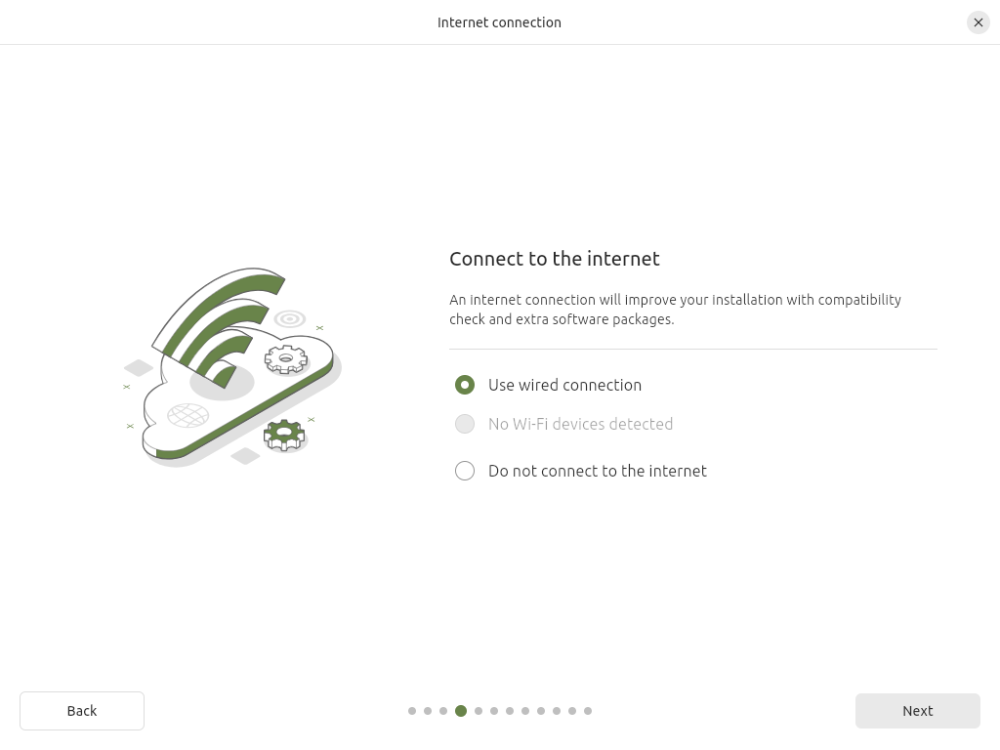](install-04-internet.png)

- Πατήστε ***Next***.

## Δοκιμή ή εγκατάσταση [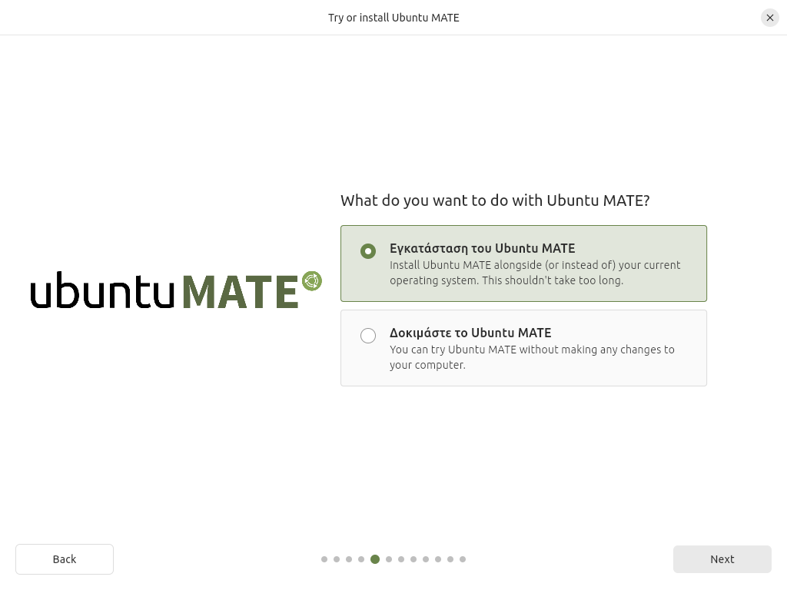](install-05-try-or-install.png)

Αν επιθυμείτε να δοκιμάσετε μόνο το Ubuntu και όχι να το εγκαταστήσετε, επιλέξτε ***Δοκιμάστε το Ubuntu MATE***. Αλλιώς:

- Επιλέξτε ***Εγκατάσταση του Ubuntu MATE***.
- Πατήστε ***Next***.

## Είδος εγκατάστασης [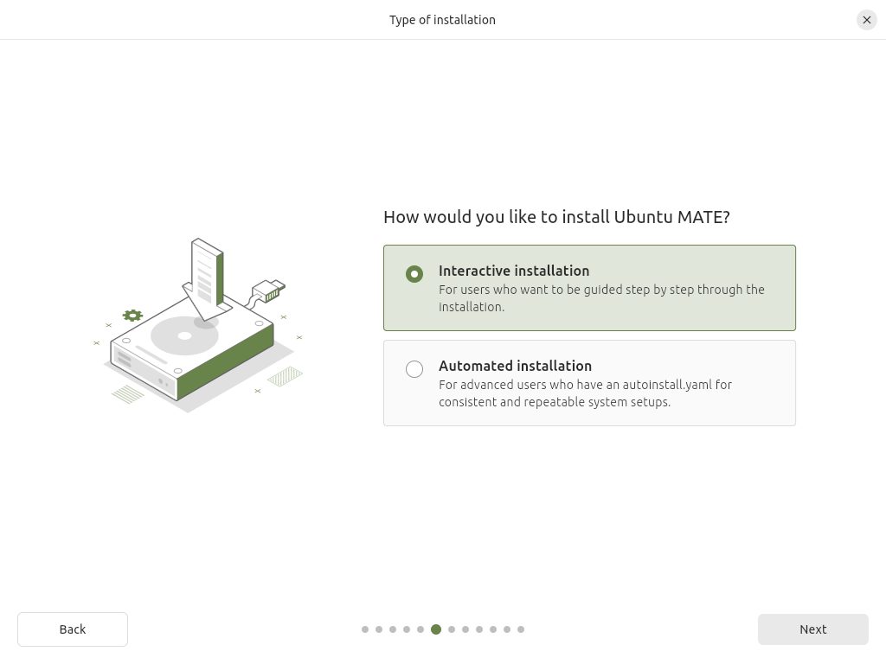](install-06-type-of-installation.png)

- Επιλέξτε ***Interactive installation***.
- Πατήστε ***Next***.

## Εφαρμογές [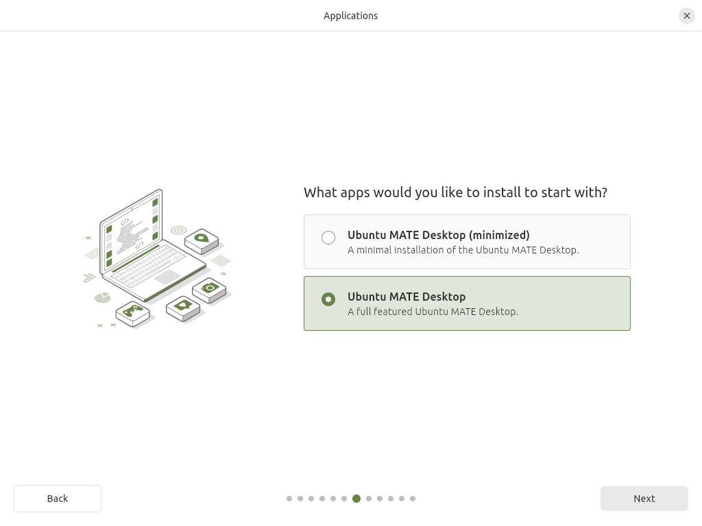](install-07-applications.png)

- Επιλέξτε ***Ubuntu MATE Desktop***.
- Πατήστε ***Next***.

## Ιδιοταγές λογισμικό [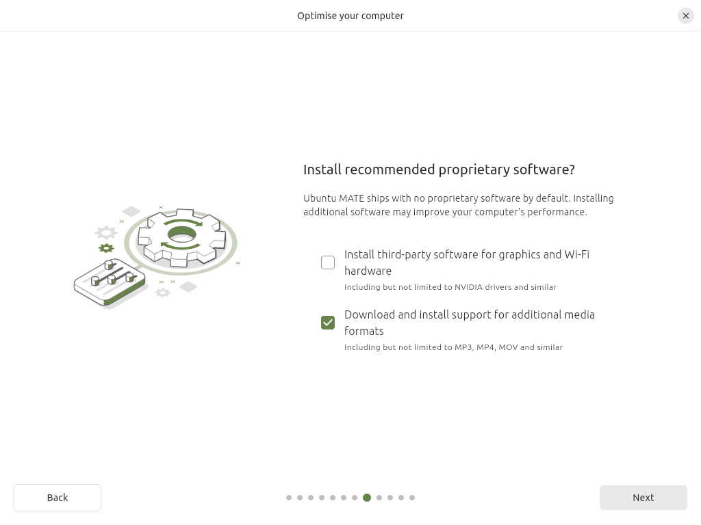](install-08-proprietary-software.png)

- Επιλέξτε ***Download and install support for additional media formats***.
- Πατήστε ***Next***.

## Ρύθμιση του δίσκου [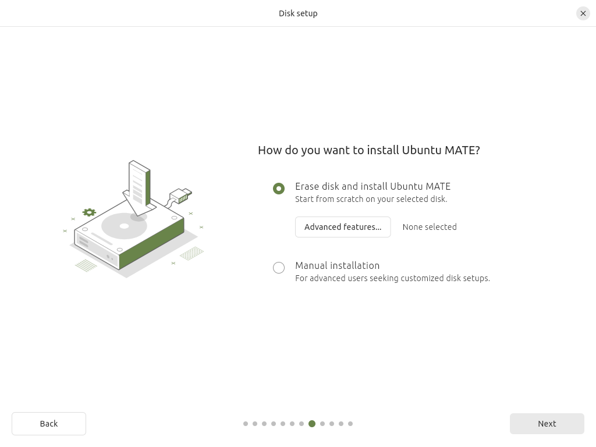](install-09-disk-setup.png)

- Επιλέξτε ***Erase disk and install Ubuntu MATE***.
- Πατήστε ***Next***.

!!! warning clear "Προειδοποίηση"
    Προσοχή, αυτό θα διαγράψε όλα τα περιεχόμενα του δίσκου! Αν χρειάζεστε κάτι
    διαφορετικό, επιλέξτε ***Manual installation***, αλλά αυτή η επιλογή δεν
    καλύπτεται από τον παρόντα οδηγό.

## Δημιουργία λογαριασμού [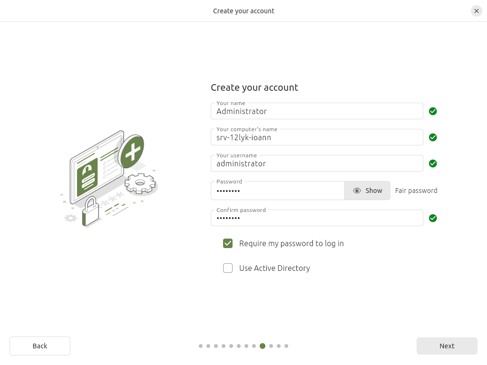](install-10-create-account.png)

- Your name: ***Administrator***. Ή αν προτιμάτε, κάντε αντιγραφή από εδώ τη
  λέξη "Διαχειριστής", αφού μάλλον σε αυτό το σημείο δεν θα μπορείτε να
  πληκτρολογήσετε Ελληνικά.
- Your computer's name: ***srv-12lyk-ioann***. Το όνομα κάθε σχολικού server
  είναι μοναδικό στο Π.Σ.Δ. και προκύπτει αν από το web site του σχολείου (π.χ.
  <https://12lyk-ioann.ioa.sch.gr>) κρατήσουμε το αρχικό κομμάτι (π.χ.
  12lyk-ioann) και προσθέσουμε "srv-" μπροστά του.
- Your username: ***administrator***. Προτείνεται να μην αλλάξετε όνομα χρήστη,
  επειδή αυτός είναι ο ιδιοκτήτης των κοινόχρηστων φακέλων.
- Password: ***<βάλτε κωδικό πρόσβασης>***
- Confirm password: ***<επανάληψη>***
- Εάν θέλετε ο administrator να μην συνδέεται κατευθείαν με το που ανοίγει ο
  υπολογιστής, επιλέξτε ***Require my password to log in***. Αυτό μπορείτε να
  το ρυθμίσετε και αργότερα.
- Πατήστε ***Next***.

## Ζώνη ώρας [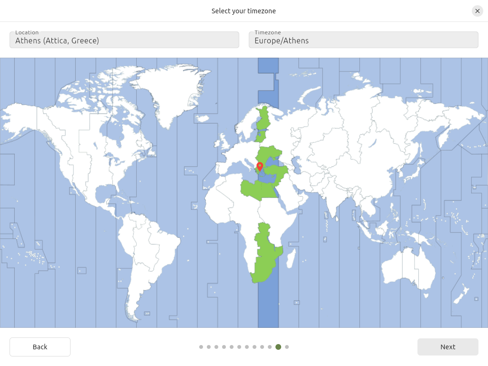](install-11-timezone.png)

- Πατήστε ***Next***.

## Έτοιμο για εγκατάσταση [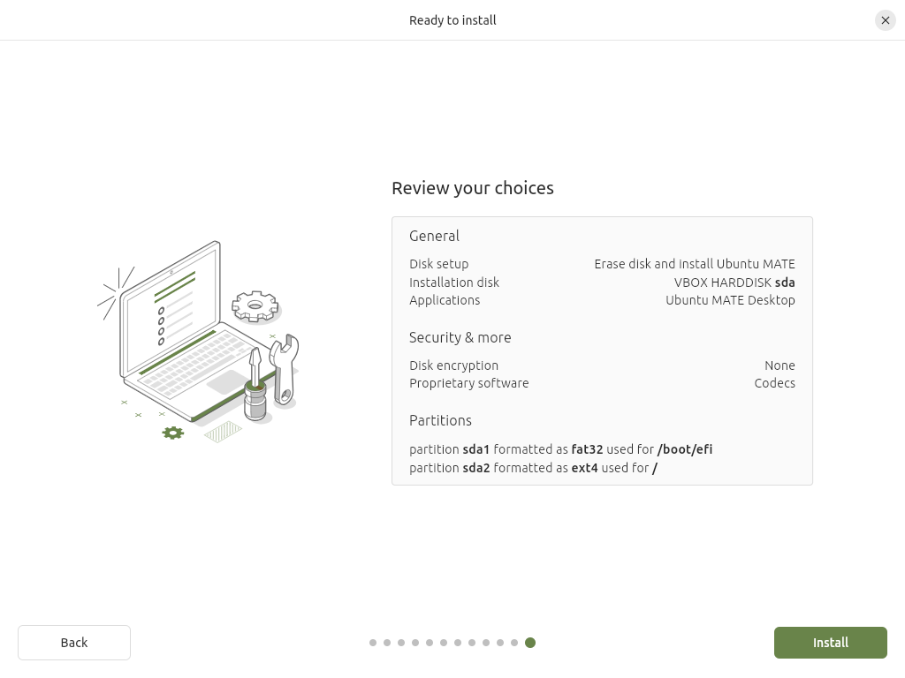](install-12-ready-to-install.png)

- Πατήστε ***Install***.

## Αντιγραφή αρχείων [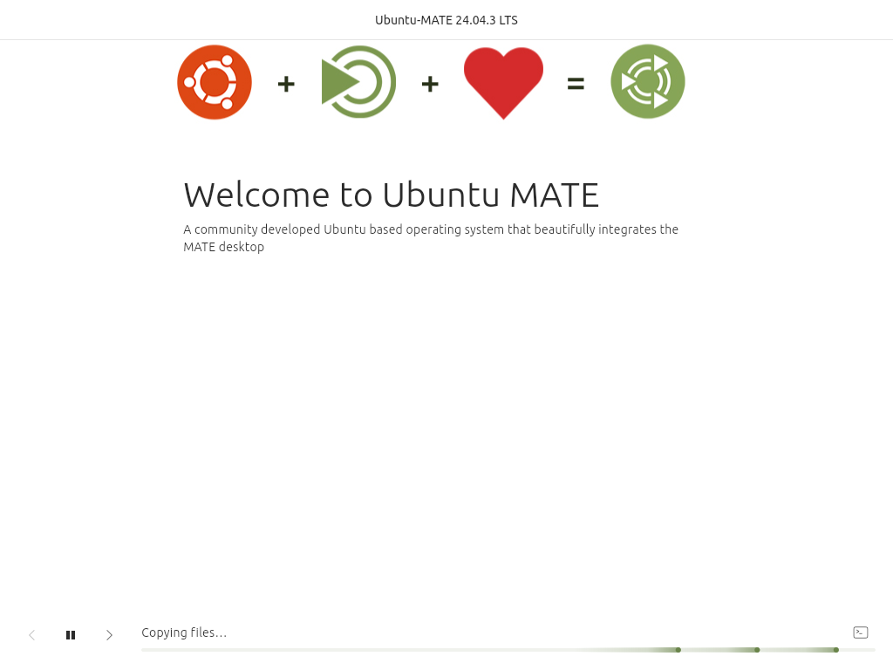](install-13-progress.png)

Ανάλογα με την ταχύτητα της σύνδεσής σας στο Internet, η λήψη και η αντιγραφή
αρχείων μπορεί να διαρκέσουν γύρω στα 15 λεπτά.

## Η εγκατάσταση ολοκληρώθηκε [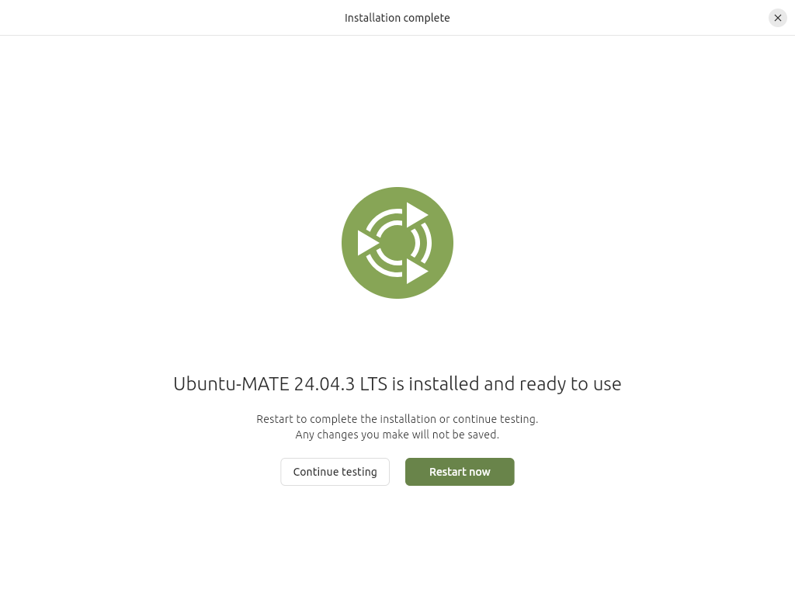](install-14-complete.png)

- Πατήστε ***Restart now***.

## Οθόνη σύνδεσης [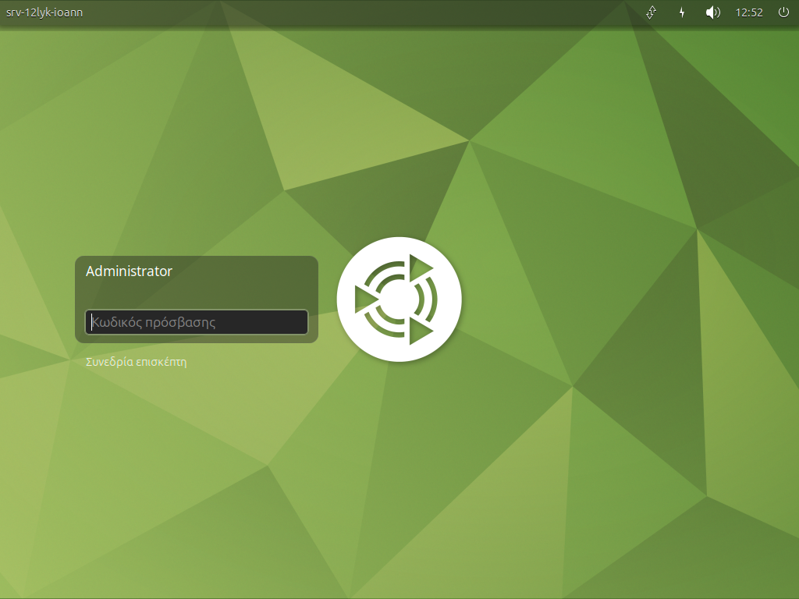](install-15-login-screen.png)

Μετά την επανεκκίνηση, αν επιλέξατε να χρειάζεται ο κωδικός πρόσβασης για την
σύνδεση, πληκτρολογήστε τον και πατήστε Enter.

## Επιφάνεια εργασίας [](install-16-desktop.png)

Μετά την σύνδεση εμφανίζεται η επιφάνεια εργασίας. Εάν πρόκειται για σχολικό
εξυπηρετητή, συνεχίστε με την [εγκατάσταση των sch-scripts](../ltsp/index.md).

Αν **δεν** θα εγκαταστήσετε τα sch-scripts, τότε για να διορθώσετε το πρόβλημα
του Ελληνικού πληκτρολογίου, ανοίξτε ένα τερματικό και εκτελέστε τις παρακάτω
εντολές:

```shell
setxkbmap -layout us,gr -option '' -option grp:alt_shift_toggle,grp_led:scroll
sudo wget https://el.ltsp.org/ubuntu/keyboard.txt -O /etc/default/keyboard
```
