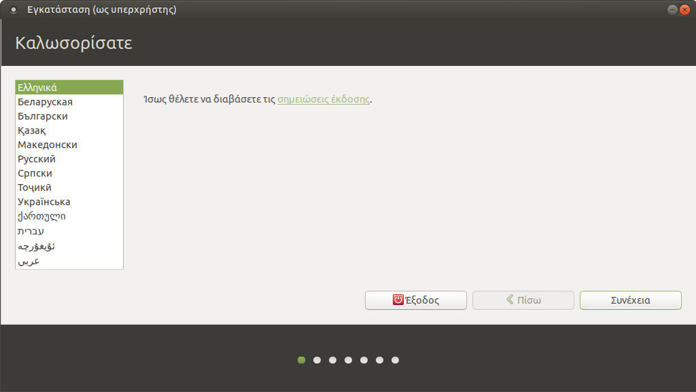
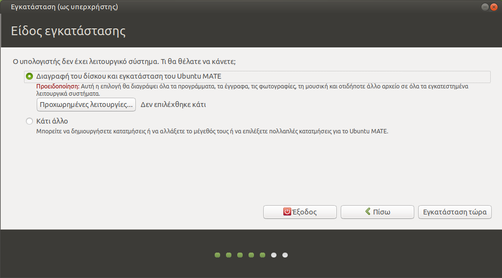
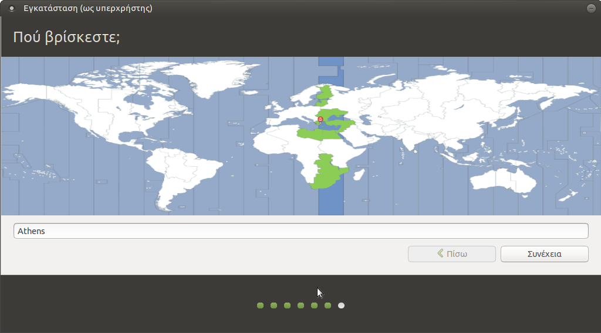

# Εγκατάσταση

Θεωρείται ότι έχετε ήδη κάνει τα βήματα [λήψης του Ubuntu](download.md) και
δημιουργίας [CD ή live USB stick](liveusb.md). Τοποθετήστε το στον υπολογιστή
και ξεκινήστε από αυτό. Μπορεί να χρειαστεί να πατήσετε κάποιο πλήκτρο όπως
**`Del`**, **`F12`**, **`Enter`** κλπ για να εμφανιστεί ο boot manager του
BIOS/UEFI.

!!! tip "Συμβουλή"

    - Είναι πιθανό το USB stick να εμφανιστεί δύο φορές στον boot manager.
      Δείτε τον οδηγό [Εκκίνηση σε κατάσταση BIOS ή UEFI](../guides/bios-uefi-boot/index.md).

    - Εάν έχετε ήδη κάποιο λειτουργικό σύστημα όπως Microsoft Windows,
      είναι σημαντικό να εκκινήσετε στην ίδια κατάσταση με το υπάρχον λειτουργικό.
      Στην περίπτωση των UEFI Windows, ακολουθήστε τον οδηγό
      [Ubuntu με UEFI Windows](../guides/install-with-uefi-windows/index.md).

## Δοκιμή περιβάλλοντος 

Μετά την εκκίνηση του υπολογιστή από το live USB stick θα εμφανιστεί μία οθόνη
που θα ρωτά στην Αγγλική γλώσσα αν θέλετε να εγκαταστήσετε το Ubuntu ή να το
δοκιμάσετε. Επιλέξτε τα ***Ελληνικά*** ως γλώσσα και πατήστε ***Δοκιμάστε το
Ubuntu MATE***. Στη συνέχεια θα βγει ο διάλογος "Καλώς ήλθατε", πατήστε
***Κλείσιμο*** για να εμφανιστεί η επιφάνεια εργασίας.

!!! warning clear "Προειδοποίηση"
    Επιλέξτε ***Ελληνικά*** ώστε το σύστημα να πάρει τις σωστές ρυθμίσεις
    γλώσσας, ακόμα κι αν προτιμάτε Αγγλικό περιβάλλον εργασίας. Μετά την
    εγκατάσταση μπορείτε να επιλέξετε τη γλώσσα από την οθόνη σύνδεσης των
    χρηστών.

## Κυρίως περιβάλλον

Στο περιβάλλον δοκιμής
μπορείτε να εκτελέσετε όποια προγράμματα θέλετε, να περιηγηθείτε στο διαδίκτυο
και να εξετάσετε ότι όλα λειτουργούν κανονικά, για παράδειγμα ήχος, αναγνώριση
δίσκων, δίκτυο κλπ. Εάν χρειάζεται να αλλάξετε το μέγεθος των κατατμήσεων του
δίσκου σας πριν την εγκατάσταση, δείτε την ενότητα για την εφαρμογή
[GParted](../guides/gparted/index.md).

Όταν είστε έτοιμοι, κάντε διπλό κλικ στο εικονίδιο ***Εγκατάσταση Ubuntu MATE
24.04 LTS***.

## Καλωσορίσατε 

- Βεβαιωθείτε ότι έχετε επιλέξει ***Ελληνικά***.
- Κλικ στο ***Συνέχεια***.

## Διάταξη πληκτρολογίου 

- ***Ελληνικό***.
- ***Ελληνικό***.
- Κλικ στο ***Συνέχεια***.

## Ενημερώσεις και άλλο λογισμικό

- Εάν πρόκειται για προσωπικό υπολογιστή, μπορείτε να επιλέξετε την
  ***Εγκατάσταση λογισμικού τρίτων για κάρτες γραφικών και Wi-Fi, καθώς και
  πρόσθετη υποστήριξη αναπαραγωγής πολυμέσων***. Σε εξυπηρετητές LTSP μην το
  επιλέγετε, είναι καλύτερο να χρησιμοποιηθεί π.χ. ο οδηγός nouveau παρά ο
  nvidia.
- Κλικ στο ***Συνέχεια***.

## Είδος εγκατάστασης

Από
αυτόν τον διάλογο ορίζονται οι κατατμήσεις όπου θα εγκατασταθεί το Ubuntu. Εάν
τυχόν έχετε ήδη κάποιο λειτουργικό στον υπολογιστή σας, προσέξτε να μην
διαγράψετε υπάρχουσες κατατμήσεις. Μπορείτε να μειώσετε το μέγεθος μίας
υπάρχουσας κατάτμησης (π.χ. το NTFS partition των MS-Windows) ώστε να προκύψει
ελεύθερος χώρος για τη δημιουργία της κατάτμησης του Ubuntu.

Επιλέξτε το είδος της εγκατάστασης ανάλογα με τις ανάγκες σας και στη
συνέχεια επιστρέψτε στην παρούσα σελίδα:

- [Δεν υπάρχει εγκατεστημένο λειτουργικό](disk-empty.md).
- [Προϋπάρχει λειτουργικό Microsoft Windows](disk-windows.md).
- [Προϋπάρχει λειτουργικό Linux](disk-linux.md).

## Πού βρίσκεστε; 

- Επιλέξτε ***Athens***.
- Κλικ στο ***Συνέχεια***.

## Πώς λέγεστε;

- Το ονοματεπώνυμό σας: ***Διαχειριστής***. Εάν για κάποιον λόγο δεν μπορείτε
  να πληκτρολογήσετε Ελληνικά σε αυτό το σημείο, κάν' τε το
  αντιγραφή/επικόλληση.
- Το όνομα του υπολογιστή σας: ***srv-12lyk-ioann***. Το όνομα κάθε σχολικού
  server είναι μοναδικό στο Π.Σ.Δ. και προκύπτει αν από το web site του
  σχολείου (π.χ. <https://12lyk-ioann.ioa.sch.gr>) κρατήσουμε το αρχικό κομμάτι
  (π.χ. 12lyk-ioann) και προσθέσουμε "srv-" μπροστά του.
- Διαλέξτε ένα όνομα χρήστη: ***administrator***. Προτείνεται να μην αλλάξετε
  όνομα χρήστη, επειδή αυτός είναι ο ιδιοκτήτης των κοινόχρηστων φακέλων.
- Διαλέξτε ένα συνθηματικό (κωδικός πρόσβασης): ***<βάλτε password>***
- Επιβεβαιώστε το συνθηματικό: ***<επανάληψη>***
- Εάν θέλετε ο administrator να συνδέεται κατευθείαν με το που ανοίγει ο
  υπολογιστής, επιλέξτε ***Αυτόματη είσοδος***. Αυτό μπορείτε να το ρυθμίσετε
  και αργότερα.
- Κλικ στο κουμπί ***Συνέχεια***.

## Αντιγραφή αρχείων 

Ανάλογα με την ταχύτητα της σύνδεσής σας στο Internet, η λήψη και η αντιγραφή
αρχείων μπορεί να διαρκέσουν γύρω στα 15 λεπτά.

## Η εγκατάσταση ολοκληρώθηκε 

- Κλικ στο ***Επανεκκίνηση τώρα***.
